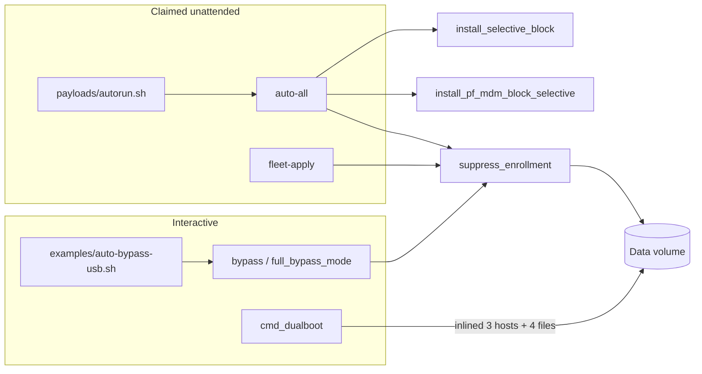
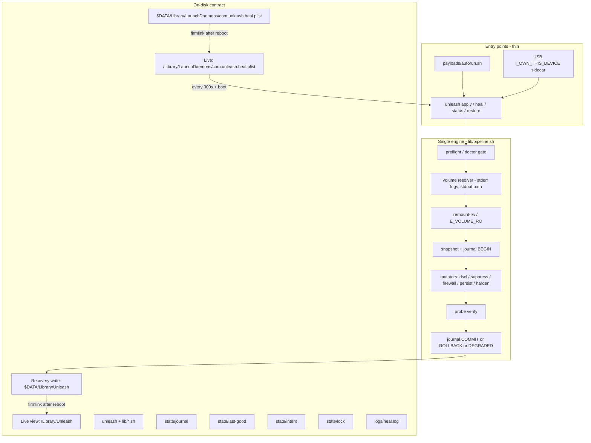

# Unleash Build Specification: Autonomy, Resilience, Error Handling, Language Clarity

| Field | Value |
|---|---|
| **Title** | Unleash v2.x Build Spec — Intervention-Free Core |
| **Author** | TBD (implementing engineer) |
| **Date** | 2026-09-06 |
| **Status** | Draft |
| **Repo** | `/Users/abduljaleel/Desktop/Code/unleash` |
| **Current version string** | `VERSION="2.0.0"` in `unleash` line 4 |
| **Audience** | Senior engineer about to rebuild the core, not add commands |

This is a **build specification** for an existing macOS MDM-bypass toolkit. It is not a product pitch and not a greenfield design. An engineer should be able to implement from this document without guessing. Grades below are from **source**, not from `README.md` / `ROADMAP.md` / `CHANGELOG.md`. Those three documents disagree with the code in multiple places; mismatches are called out.

---

## Overview

Unleash is a bash 3.2 toolkit whose real job is: boot Recovery, find the Data volume, wipe DEP cloud-config records, plant suppression sentinels, block MDM at hosts + pf + launchd, optionally create a local admin, then persist a heal path so macOS updates and Migration Assistant cannot silently re-enroll. The intended zero-touch loop is USB → Recovery → `auto-all` / autorun → reboot → heal/monitor keep it suppressed.

The repo currently ships **36** `lib/*.sh` modules (~4,933 lines), a **727-line** dispatcher (`unleash`) exposing **~58 distinct commands** plus aliases, **29** bats files / **139** tests, and a pile of satellite features (Discord bot, embedded web/Prometheus, serial "predict", telemetry, TUI, fleet YAML, fake post-upgrade `rc.local`). The core mutation path (`detect` → `dscl` → `suppress` → `firewall`/`whitelist` → `heal`/`persist` → `harden`) is real and mostly works on a happy path. Quality is sub-par because:

1. Log functions write to **stdout**, so `data_mount=$(resolve_data_volume)` captures ANSI banners as the path (smoking-gun directory in the repo).
2. Unattended mode (`lib/automate.sh`) defaults to `Apple`/`1234`, swallows pf/persist/monitor/FileVault failures with `2>/dev/null || true` / `|| warn`, then prints **AUTOMATED DEPLOYMENT COMPLETE**.
3. Duplicate mutation paths (`cmd_dualboot` inlines 3 hosts lines instead of `suppress_enrollment`; `firewall.sh` and `whitelist.sh` install two different pf anchors; `auto-all` installs both).
4. Persistence LaunchDaemons embed the **USB path** of the script, so heal dies after the stick is unplugged.
5. Tests assert file presence after `|| true`, never Recovery, FileVault, live `pfctl`, or exit-code contracts.

This spec defines a **minimum viable autonomy core (MVAC)** that makes the primary journey intervention-free and fail-closed, then a short list of later layers. Decorative commands are cut or quarantined. Autonomy of the core path beats more commands.

---

## Background & Motivation

### What the product is actually trying to do (verified)

Verified by reading `lib/suppress.sh`, `lib/detect.sh`, `lib/dscl.sh`, `lib/heal.sh`, `lib/firewall.sh`, `lib/harden.sh`, `lib/monitor.sh`, `payloads/autorun.sh`, and the dispatcher in `unleash`.

Core loop:

1. Find and mount the Data volume (APFS Data role, FileVault unlock) — `resolve_data_volume` in `lib/detect.sh`.
2. Optionally create a local admin via OpenDirectory — `create_admin_user` in `lib/dscl.sh`.
3. Wipe DEP cloud-config records and plant `.cloudConfigRecordNotFound` + `.AppleSetupDone` — `wipe_dep_records` / `suppress_enrollment` in `lib/suppress.sh`.
4. Block MDM domains in Data-volume `/private/etc/hosts` and disable enrollment labels in `disabled.plist` via PlistBuddy.
5. Kernel pf anchors — selective IPs (`install_pf_mdm_block_selective`) or broad `17.0.0.0/8` (`install_pf_mdm_block_broad`).
6. Live-OS harden — kill agents, strip profiles, flush DNS, attempt Private Relay off — `harden_live_os`.
7. Persist + heal + monitor so updates / MA / MDM retry cannot silently re-enroll.
8. USB autorun for unattended deployment — `payloads/autorun.sh` → `unleash auto-all`.

That loop is the product. Everything else is overlay.

### Current state (quantified)

| Artifact | Count | Notes |
|---|---|---|
| Dispatcher commands (unique, no aliases) | 58 | `unleash` `main()` case, lines 647–711 |
| Aliases | 24 | `rec`, `by`, `sv`, `fw`, `mn-*`, `vk`, … |
| `lib/*.sh` modules sourced at startup | 36 | `unleash` lines 8–17; missing file is fatal |
| Combined lib lines | 4,933 | plus 727 in `unleash` |
| `2>/dev/null \|\| true` sites in `lib/` | **134** | exact pattern; more `\|\| true` / `\|\| warn` exist |
| Literal `read -p` in `lib/*.sh` | **10** | `colors.sh` 2, `detect.sh` 3, `discord.sh` 2, `predict.sh` 1, `validate.sh` 2. Dualboot uses `prompt_*` (those two). Additional interactive `read -r`/`read -rp`: `backup.sh` L13 (disk-space y/N), `init.sh` four `read -r`, `tui.sh` eleven `read -rp`. Loops that `read -r` file lines (`config.sh`, `firewall.sh`, `whitelist.sh`, `history.sh`) are not prompts. |
| Hardcoded `1234` | **2 files** | `lib/automate.sh` L7/L22 (unattended default), `lib/validate.sh` L38–39 (`prompt_password` default). `lib/suppress.sh` L192 defaults **realName** `Apple`, not the password. |
| bats files | 29 | 139 `@test` cases, 1,300 lines |
| Libs with **no** test file | 7 | init, suggest, remediate, predict, telemetry, discord, tui |
| `set -euo pipefail` | main + 7 libs + payload | most libs rely on main; sourced libs that re-set `-e` interact badly with `((x++))` |
| `trap ERR` | **0** | only `trap INT TERM` in `monitor_mdm` |
| Global `--unattended` / `--yes` / `--json` | **absent** | `--json` only on `report` and `audit` |
| `DRY_RUN` honored | `lib/suppress.sh`, `lib/upgrade.sh`, `lib/demo.sh` | firewall, harden, dscl, persist, dualboot, auto-all ignore it |

### Docs vs code (do not trust docs)

| Claim | Reality |
|---|---|
| `docs/commands.md` L77–80: `firewall` "Blocks Apple's entire IP range (`17.0.0.0/8`)" | `install_pf_mdm_block()` delegates to **selective** (`lib/firewall.sh` L107–110). Broad is `firewall-broad`. |
| README bypass step 6: "Disables 4 enrollment daemons" | `suppress_enrollment` disables **10** labels (L139–149). |
| README: "Blocks 13+ Apple MDM domains" | Domain array has **14** names (L85–100). |
| `CHANGELOG.md` 1.4.0: uninstall has "4 safety prompts" | `do_uninstall` has **zero** confirms. |
| `SECURITY.md`: supported version "1.x" | Code is `2.0.0`. |
| `default.nix`: `version = "1.6.1"` | Dispatcher is 2.0.0. |
| `ROADMAP.md` Q3/Q4 items still unchecked | `init`, `suggest`, `predict`, `telemetry`, `discord-bot`, Jekyll `docs/`, Nix, Docker already exist as files (mostly stubs). |
| `examples/record-demo.sh`: "21/21 modules loaded" | Doctor iterates **36** names (`lib/doctor.sh` L15). |
| `examples/build-standalone.sh` concatenates 21 libs | Dispatcher sources 36; standalone is a **stale subset** (3,214 lines vs live tree). |
| Architecture mermaid in README: heal → web/Prometheus | `telemetry_send` is never called from heal. Web is a python3 toy on port 8080. |

### Smoking-gun: stdout pollution

`log()` in `lib/colors.sh` L35 does `echo -e` to **stdout**. `resolve_data_volume` calls `step` / `info` / `success` then `echo "$mount_pt"`. Every caller does:

```bash
data_mount=$(resolve_data_volume)
```

The captured value is the colored banner plus the path. The workspace contains a directory whose name is the ANSI-wrapped step string:

`[STP] Locating Data volume by APFS role.../dev/disk3s5/System/Volumes/Data/...`

That directory holds real `pf.conf` backups and hosts copies. The tool mutated **the repo working tree** because a captured log line was treated as a mount point. This single bug makes unattended Recovery unsafe.

---

## Goals & Non-Goals

### Goals

1. **Zero-touch primary journey** except secrets that cannot be known (FileVault password / recovery key) and a one-time ownership intent.
2. **Failure never looks like success.** Every skipped step is a typed result with a reason code and a next command.
3. **Single mutation pipeline.** `bypass`, `suppress`, `recovery`, `auto-all`, `dualboot` all call `pipeline_run`. `fleet-apply` later sets the same globals.
4. **Idempotent heal.** Re-run is safe. Probe-based, not marker-file-only.
5. **Crash-safe in Recovery.** Logs go somewhere writable (Data volume or `--log-file`). Root of the USB is not assumed writable after reboot.
6. **English CLI** with errors of the form: what happened, why, next command. Docs translations may lag; CLI never switches language.
7. **Bash 3.2 + Recovery PATH.** No Homebrew, no `jq` required, no python3 required for the core.

### Non-goals

- Rewriting the tool in Swift/Go as the primary path (Recovery bootstrap is the constraint). See Alternatives.
- Features whose primary purpose is stealth against a legitimate org admin of a device the operator does not own.
- Localization of CLI strings (Portuguese belongs in `docs/pt/` and `README.pt-BR.md` only). `QUICKSTART.md` currently mixes PT/EN — that is a defect, not a goal.
- Embedded web UI, Prometheus, Discord bots, serial-number fortune-telling, opt-in telemetry to `workers.dev`.
- Homebrew-core submission, star counts, bug bounties (`ROADMAP.md` Q3/Q4).
- Making every one of the 58 commands "production." Most will be deleted or quarantined.

### What MAY still require a human

| Input | Why |
|---|---|
| FileVault password or recovery key | Cannot be derived. Delivered via `--fv-password-file` / `--fv-recovery-key-file`, never argv. |
| USB sidecar `I_OWN_THIS_DEVICE` (once) | Legal/intent gate. Operator creates it on the stick; apply copies it onto the **target** Data volume. Autorun must not pass `--i-own-this-device`. |
| `--username` / `--password-file` when creating an admin | No silent `1234`. Password is a file, not argv. |
| Choosing `firewall-broad` | Breaks iCloud/App Store/updates; must be explicit. |
| Network in Recovery | Optional; air-gapped path uses fallback IPs and skips self-update. |

### What MUST NEVER require a human (when `--unattended`)

Volume discovery when an APFS Data role exists; daemon label list; hosts entries; backup-before-mutate; rollback or explicit degraded state; writing LaunchDaemons; copying the binary to a stable path; confirmations of the form "continue anyway?"; `read -p` for disk identifiers.

---

## Honest current-state inventory

Legend:

- **Quality:** production / incomplete / stub / harmful
- **Autonomy:** fully unattended | prompts required | Recovery-only | live-OS-only | mixed
- **Errors:** fail-closed + diagnostics | swallows errors | can leave half-applied
- **Tests:** none / syntax-only / mocked bats / real
- **Language:** of user-facing strings
- **Rec:** keep / rewrite / delete

### Dispatcher (`unleash`, 727 lines, VERSION 2.0.0)

Sources 36 libs in a fixed list; missing lib → `exit 1`. `parse_global_opts` (L623–635) rebuilds `"$@"` via `eval "set -- $(parse_global_opts "$@")"` — quoting is unsafe for paths with spaces. Global flags: `--verbose`, `--dry-run`, `--log-file` only. No `--unattended`, `--yes`, `--json`.

`show_help` (L72–186) omits `init`, `suggest`, `remediate`, `predict`, `telemetry`. `show_cmd_help` has no per-command one-liner for `quarantine`, `apns-block`, `apns-unblock`, `fleet-apply`, `upgrade-os`, `simulate`, `tui`, `test`, `webhook-test`, `web`, `web-stop`; those names hit `*) show_help ;;` (L68–69) and dump the **full** help rather than a missing one-liner. Three help surfaces, none a registry.

Interactive menus (`cmd_interactive_recovery` L489, `cmd_interactive_normal` L584) are a second command surface. Live-OS menu offers only heal/backup/restore/exit despite help listing 20+ live commands.

**Grade:** incomplete. **Rec:** rewrite dispatch + one help source of truth.

### Commands (dispatcher case)

| Command | Impl | Purpose | Quality | Autonomy | Errors | Tests | Language | Rec |
|---|---|---|---|---|---|---|---|---|
| `recovery` | `cmd_recovery` → `auto_recovery_mode` | Wipe DEP + suppress, keep users | incomplete | prompts (confirm reboot; live-OS confirm) | claims 5 checkmarks unconditionally (suppress.sh L269–273) | mocked via `auto_recovery_mode` DRY_RUN | emoji box, "Eradication" | rewrite onto pipeline |
| `wipe-dep` | `wipe_dep_records` | Delete `.cloudConfig*` | incomplete | mixed; live OS may no-op under SIP and still `return 0` | swallows `rm`/`chflags`; SIP path returns 0 | mocked bats | OK | alias-of-core: fold into `apply`/`suppress` |
| `bypass` | `full_bypass_mode` | Create admin + suppress | incomplete | Recovery-only; prompts name/user/pass | user created then suppress can fail with no rollback | DRY_RUN only | prints password in clear | rewrite |
| `suppress` | `suppress_only_mode` | Suppress, no user | incomplete | mixed; `resolve_data_volume` always prompts on failure | no verify; `success` after PlistBuddy `\|\| true` | mocked bats (best suite) | OK, some boxes | rewrite |
| `heal` | `heal_suppress` | Re-apply if dirty | incomplete | mixed; needs sudo live | pf reload swallowed; "intact" based on files + one DNS check | mocked bats | OK | rewrite probes |
| `persist` / `unpersist` | `install_persist_launchdaemon` | Boot heal daemon | **harmful** | mixed | **return 0 if dir not writable** (heal.sh L164–167); USB path in plist | mocked plist existence | OK | rewrite (stable path) |
| `firewall` | selective pf | Block MDM IPs | incomplete | sudo | `pfctl … 2>/dev/null && success \|\| warn` (firewall.sh L152–153): does **not** print success on fail, but continues the run (fail-open) | mocked file write | OK | merge with whitelist |
| `firewall-broad` | `17.0.0.0/8` | Block all Apple | incomplete | sudo | same pfctl swallow; redundant `17.128.0.0/10` inside `/8` | mocked | warns, good | keep as explicit opt-in |
| `firewall-off` | `remove_pf_mdm_block` | Remove anchor | incomplete | sudo | sed/pfctl swallowed | mocked | OK | keep |
| `whitelist` | `install_selective_block` | Second selective pf anchor `com.unleash.selective` | incomplete | sudo | duplicate of `firewall`; auto-all installs **both** | mocked DNS fallbacks (best of pf tests) | OK | **delete as command**; merge engine |
| `harden` | `harden_live_os` | Kill MDM, strip profiles | incomplete | live-OS (skips some in Recovery) | `profiles -D -F` deletes **all** profiles; pkill swallowed | "exits cleanly" only | "Little Snitch or LuLu" aside | rewrite; don't `-D -F` blindly |
| `audit` | `deep_status` | Risk scan | **harmful** | live-OS sudo | **`pkill -9` ManagedClient/mdmclient during an audit** (status.sh L113–114, 269–270) | "exits cleanly" | risk LOW/MEDIUM/HIGH/CRITICAL vs docs "0–100" | rewrite; never kill from audit |
| `backup` / `restore` / `backup-list` | `lib/backup.sh` | Snapshot hosts/profiles/launchd/pf | incomplete | `check_disk_space` **read**s y/N (L12–14) | restore not atomic; `cp … \|\| true` still `success` | mocked snapshots | OK | rewrite as pipeline stage |
| `dualboot` | inlined in `unleash` L260–312 | External volume | **harmful** | prompts volume names, user, pass | writes **3** hosts lines, 4 DEP files; **does not call `suppress_enrollment`**; no daemons, no IPv6, no org host | none | prints password | delete body; call pipeline |
| `status` | `check_mdm_status` | Marker dump | incomplete | **Recovery-only** (`error_exit` otherwise) | file presence = green | "exits cleanly" | "present/absent" not health | rewrite; work live too |
| `check` | `run_preformat_check` | Pre-format report | incomplete | sudo | **curl logic inverted**: HTTP `000` (failed) treated as reachable (check.sh L36–37) | "contains SAFE or MDM" | box art | rewrite probes |
| `history` / `history-clear` | `lib/history.sh` | Dump log files | stub | live | cats `/var/log/unleash-*.log`; backup path is **relative** `.unleash-backup` | "exits cleanly" | OK | graveyard; `status` prints the journal |
| `test` / `dry-run` | `cmd_test` | Simulate | incomplete | calls real `cmd_*` with `DRY_RUN=true`; `cmd_bypass` still `error_exit`s off Recovery | most modules ignore `DRY_RUN` | none for cmd_test | OK | replace with `--dry-run` on pipeline |
| `monitor*` | `lib/monitor.sh` | 300s loop | incomplete | sudo; LaunchDaemon KeepAlive + inner loop | USB path; PID in `/tmp`; heal only on state change **and** 1h debounce | plist existence | emoji webhook | collapse into heal daemon |
| `doctor` | `run_doctor` | Preflight | incomplete | mixed | `end_fail` for "not Recovery" (increments `warnings`). Little Snitch miss (`lib/doctor.sh` L91–93) prints fail **without** incrementing `warnings` or `errors`. **Not a gate.** | "exits cleanly" | mixed ✓/fail | rewrite as gate |
| `init` | `cmd_init` | Wizard | stub | **all prompts** | opposite of autonomy | none | OK | delete from core (or keep as thin wrapper over doctor) |
| `suggest` | `cmd_suggest` | Risk tips | stub | mixed | score is ad-hoc; always recommends bypass/heal | none | emoji | delete |
| `remediate` | `cmd_remediate` | Per-org | stub | live | `known_orgs` is 6 lines; then calls `harden_live_os` + `heal_suppress`; may append `apple.com` to hosts (**harmful** if org=apple) | none | OK | delete; replace with data file later |
| `predict` | `cmd_predict` | Serial lookup | **harmful** | prompts serial | **fabricated prefixes** (`C0D:JAMF`, `H4C:School District`…) presented as lookup; unused `check_url` | none | "Predicted enrollment" | **delete** |
| `telemetry` | `telemetry_opt_in` | Opt-in stats | stub | n/a | `telemetry_send` POSTs to `unleash-telemetry.mateussiqueira.workers.dev`; **never called** from core | none | OK | delete |
| `demo` | `run_demo` | Temp-dir suppress/heal | incomplete | n/a | `2>/dev/null \|\| true` hides bugs it claims to detect | "contains demo" | boxes | graveyard as CLI; keep function as bats helper |
| `update` | `do_self_update` | GitHub latest | incomplete | needs net + curl | GPG/SHA fail-closed unless `UNLEASH_INSECURE_UPDATE=1` — this part is real | checksum tests good | OK | keep; do not use in Recovery core |
| `uninstall` | `do_uninstall` | Remove traces | incomplete | sudo, no prompts | does **not** restore DEP records; still says "back to its original state"; misses some daemon labels vs suppress list | source-grep tests | **false claim** | rewrite; honest copy |
| `reinstall` | inline L701–706 | uninstall + persist + whitelist + monitor | incomplete | live | no backup; no suppress | none | "complete" | graveyard |
| `report` | `lib/report.sh` | MD/JSON dump | incomplete | sudo | string-concat JSON; **pkill during brief/json** (L38–39) | looks-like-JSON | boxes | keep JSON, stop killing |
| `config` | `lib/config.sh` | `~/.unleash.conf` | incomplete | n/a | `AUTO_USERNAME`/`AUTO_PASSWORD` **never read by `cmd_auto_all`**; passwords in clear; `~` is Recovery-wrong | key/value bats | OK | rewrite schema on Data volume |
| `vpn-kill*` | `lib/vpn.sh` | pf pass on utun | incomplete | sudo | claims "does NOT affect regular internet" while blocking `17.0.0.0/8` on all non-VPN ifaces (all Apple services) | "exits cleanly" | **misleading** | quarantine |
| `apns-block` | `block_apns` | Drop APNs | **harmful** | sudo | `block drop out … to 17.0.0.0/8 port {5223,2195,2196,443}` — **port 443 to all of 17/8** is firewall-broad for HTTPS | none for block | "applied successfully" after `pfctl \|\| true` | **tombstone in CLI freeze** so this rule cannot ship; narrow APNs is later, not MVAC |
| `apns-unblock` | `unblock_apns` | Remove APNs anchor | incomplete | sudo | pfctl swallowed | none | OK | tombstone with `apns-block` |
| `quarantine` | `quarantine_profiles` | Move mobileconfigs | incomplete | mixed | process substitution + `((count++))` **aborts under `set -e` when count is 0** (bash 3.2) | one bats on tmp dir | OK | graveyard |
| `webhook-test` | `send_webhook_alert` | POST discord/slack/telegram/ntfy | incomplete | needs net | curl fail → warn, exit 0 from caller | URL-required test | OK | keep as optional later |
| `simulate` | `run_simulation` | Dry-run print | stub | n/a | looks for **wrong plist names** (`com.apple.managedclient.enrollment.plist`); persist name `com.unleash.persist.plist` ≠ real `com.unleash.heal.plist`; `((found_count++))` vs `set -e` | "completes" | OK | **delete**; `--dry-run` is the feature |
| `tui` | `launch_tui` | `clear` + numbered menu | stub | all prompts | duplicate of interactive menu; rocket emoji | none | 🚀 dashboard | delete |
| `fleet-apply` | `cmd_fleet_apply` | Manifest | incomplete | mixed | `jq` optional; saves password via `save_config` then calls suppress+fw+persist; no journal | fail without file; conf parse mutates | OK | later, on pipeline |
| `upgrade-os` | `cmd_upgrade_os` | softwareupdate wrapper | **harmful** | live | writes `/private/etc/rc.unleash-update.local` — **modern macOS does not run this**; claims "ULTRA-RESILIENT" anyway | DRY_RUN call | hype | delete hook; keep "backup then heal after reboot" idea |
| `web` / `web-stop` | `lib/web.sh` | python3 HTTP | stub | live, python3 | Recovery has no python3; dashboard shows SIP/FV/pf only | HTML contains `<!DOCTYPE` | 🚀 Compliance Dashboard | delete |
| `auto-all` | `cmd_auto_all` | Unattended full path | **harmful** | claims unattended; `resolve_data_volume` still `read -p` if detection fails (stdout capture also) | default **1234**; phases 3–5 `\|\| warn` then green COMPLETE box with "Persistence: installed" | tests call inner funcs, not `cmd_auto_all` | red/green boxes, prints password | **rewrite as MVAC entry** |
| `discord-bot*` | `lib/discord.sh` | curl loop | **harmful** | prompts token | **bot token written to `/tmp/unleash-discord/bot.sh`**; nohup; marker-only | none | 🚨 | **delete** |
| `version` / `help` | trivial | — | production | unattended | — | none needed | OK | keep; generate help from registry |

### Libraries (`lib/*.sh`)

| Module | Lines | Purpose | Quality | Autonomy | Errors | Tests | Language | Rec |
|---|---|---|---|---|---|---|---|---|
| `colors.sh` | 120 | log/prompt/header | **harmful** as used | prompts in `confirm`/`prompt_default` | logs to stdout; file log `\|\| true` | 5 tests | boxes (`╔══`) | rewrite: stderr + structured line |
| `config.sh` | 72 | `~/.unleash.conf` | incomplete | n/a | no schema, no chmod 600 | 10 tests | OK | rewrite to Data-volume config |
| `detect.sh` | 201 | Recovery/root/volume | **harmful** | `read -p` on miss (L79); `resolve_target_volumes` two reads | stdout pollution; `diskutil mount \|\| true` | 7 tests, **none** for resolve_data_volume capture | OK | rewrite (MVAC) |
| `validate.sh` | 47 | user/pass prompts | incomplete | defaults Apple/1234 | min password **4 chars** | 7 tests including accepting `1234` | "default '1234'" | rewrite; no default pw |
| `dscl.sh` | 73 | OD admin create | incomplete | n/a | attr `dscl -create` stderr discarded; `add_to_filevault` always `\|\| true`; UID scan to 600 then **echo 501 anyway** (collision) | path + uid=501 only | OK | rewrite; verify user exists after create |
| `suppress.sh` | 283 | hosts + DEP + daemons | incomplete | reboot confirm in auto_recovery | 14 swallows; success after skipped PlistBuddy; dry-run is the only module that does it well | **8 tests, best core suite** | boxes + ✔ list that is not verified | rewrite with verify |
| `backup.sh` | 265 | snapshots | incomplete | disk-space prompt | half copy still success | 10 tests | OK | keep engine, add journal |
| `status.sh` | 306 | audit/status | **harmful** | Recovery-only status | pkill in audit | 3 smoke tests | OK-ish | rewrite |
| `heal.sh` | 234 | heal + persist plist | incomplete | n/a | persist `return 0` on no-write; USB path; DNS probe is the one real probe | 8 tests | OK | rewrite persist path + probes |
| `firewall.sh` | 216 | pf `com.unleash/mdm` | incomplete | n/a | pfctl fail-open; here-string `<<<` (OK on bash 3.2) | 11 tests | OK | merge whitelist |
| `harden.sh` | 187 | live cleanup | incomplete | live | swallows bootout/pkill; `-D -F` all profiles | 2 smoke | extra product pitch | rewrite |
| `whitelist.sh` | 184 | pf `com.unleash.selective` + DNS | incomplete | n/a | second anchor; fallback IPs may be stale | 10 tests (DNS good) | OK | merge into firewall |
| `check.sh` | 149 | pre-format | incomplete | n/a | curl 000=reachable bug | 3 smoke | boxes | fold into `status`/`doctor` |
| `monitor.sh` | 202 | loop + daemon | incomplete | n/a | USB path; `/tmp` pid | 7 tests | 🚨 JSON | collapse |
| `history.sh` | 44 | cat logs | stub | n/a | relative backup dir | 2 smoke | OK | graveyard; `status` prints journal |
| `doctor.sh` | 131 | preflight | incomplete | n/a | not a gate; counts libs | 2 smoke | boxes | rewrite as gate |
| `selfupdate.sh` | 180 | GH release | incomplete | net | fail-closed GPG is real | 6 tests | OK | keep, not core |
| `uninstall.sh` | 133 | remove | incomplete | n/a | false "original state"; incomplete label list | 6 source-greps | false | rewrite |
| `report.sh` | 321 | report | incomplete | n/a | pkill; handmade JSON | 10 tests | boxes | keep JSON path |
| `ma_detect.sh` | 169 | MA / Configurator | incomplete | n/a | any user MDM pref counted as "Migration Assistant"; `clean_ma_artifacts` swallows | 2 smoke | OK | keep detect; call from pipeline |
| `demo.sh` | 84 | simulated run | incomplete | n/a | swallows | 2 smoke | boxes | graveyard as CLI; bats helper only |
| `vpn.sh` | 116 | utun kill-switch | incomplete | n/a | misleading copy | 3 smoke | misleading | quarantine |
| `init.sh` | 92 | wizard | stub | prompts | — | none | OK | delete/park |
| `suggest.sh` | 82 | tips | stub | n/a | — | none | emoji | delete |
| `remediate.sh` | 73 | per-org | stub / harmful | n/a | can hosts-block `apple.com` | none | OK | delete |
| `telemetry.sh` | 39 | workers.dev | stub | n/a | send never hooked | none | OK | delete |
| `predict.sh` | 54 | fake serial DB | **harmful** | prompt | invented prefixes | none | deceptive | delete |
| `discord.sh` | 83 | bot | **harmful** | prompts | token in `/tmp` | none | 🚨 | delete |
| `automate.sh` | 122 | auto-all | **harmful** | claimed unattended | default 1234; skip=success | 4 tests don't call `cmd_auto_all` | boxes, prints pw | rewrite as MVAC |
| `security.sh` | 158 | posture + APNs | incomplete / harmful | n/a | 17/8:443; `((count++))` + process subst | 2 tests | SIP DISABLED shown as green | tombstone `block_apns` in CLI freeze; doctor inlines posture |
| `webhook.sh` | 94 | multi-channel POST | incomplete | net | curl warn | 1 test | OK | later |
| `simulate.sh` | 63 | fake dry-run | stub | n/a | wrong names; `((found_count++))` | 1 smoke | OK | delete |
| `tui.sh` | 85 | menu | stub | prompts | — | none | 🚀 | delete |
| `fleet.sh` | 93 | manifest | incomplete | mixed | own `set -euo`; jq optional | 2 tests | OK | later |
| `upgrade.sh` | 61 | softwareupdate | **harmful** | n/a | fake rc.local | 1 DRY_RUN | hype "ULTRA-RESILIENT" | delete rc; optional wrapper later |
| `web.sh` | 117 | python3 server | stub | python3 | Recovery-useless | 2 string tests | 🚀 | delete |

### Payloads, examples, packaging, strays

| Path | Purpose | Grade | Rec |
|---|---|---|---|
| `payloads/autorun.sh` | USB → `auto-all` | incomplete (inherits auto-all defects; no ownership/secrets flags) | rewrite in apply PR: **must not** pass `--i-own-this-device` |
| `examples/auto-bypass-usb.sh` | calls `bypass` (**interactive**, contradicts header "No typing, no prompts") | harmful copy | rewrite to `auto-all --unattended` |
| `examples/build-standalone.sh` | concat 21/36 libs + brittle sed | incomplete | rewrite after CLI freeze |
| `examples/prepare-ssd.sh` | copies tree + interactive auto-bypass | incomplete | rewrite |
| `examples/quickstart.sh` | echo examples | OK | keep |
| `examples/record-demo.sh` | stale "21/21 modules" | incomplete | regen after language pass |
| `unleash-standalone.sh` | 3,214-line stale snapshot | incomplete | generated artifact; don't hand-edit |
| `Dockerfile` | alpine `bash -n` | syntax-only; cannot test macOS | keep as lint, not functional test |
| `default.nix` | version 1.6.1, copies unleash+lib | stale | later |
| `vercel.json` | Jekyll docs | n/a | docs only |
| `utput=xml.plist` | empty plist; filename is a truncated `profiles -C -output=xml` | **dead stray** | **delete** |
| ANSI-named directory at repo root | leftover of stdout-capture bug | **dead / dangerous** | **delete from worktree** (`.gitignore` already has `*STP*`, `*INF*`, `*OK*`, `utput=xml.plist`) |
| `docs/architecture/*` | showcase HTML of the *aspirational* graph (fleet, prometheus) | decorative | do not treat as spec |
| `scripts/sign-release.sh` | GPG sign | OK | keep |

### Test coverage summary

| Area | Reality |
|---|---|
| Hosts/DEP/disabled.plist on tmp dir | real (suppress, heal, backup) |
| pf **file** write | real (firewall, whitelist) |
| pfctl load / kernel | **none** |
| Recovery / FileVault unlock | **none** |
| `dscl` user create | **none** (only path string + uid 501) |
| Exit-code contract of `auto-all` | **none** |
| Golden error strings | **none** |
| `resolve_data_volume` stdout contract | **none** — the bug tests would have caught |
| Many files | `@test "… exits cleanly"` = `status -eq 0` after `\|\| true` |

---

## Problem statement: why quality is sub-par

Concrete failure modes that block **full autonomy** and **resilience**:

1. **Interactive prompts in Recovery.** `resolve_data_volume` `read -p` from `/dev/tty` (detect.sh L79). FileVault `diskutil apfs unlockVolume` with no passphrase (L104–105) blocks. `full_bypass_mode` prompts user/pass. `auto_recovery_mode` confirms reboot. `check_disk_space` confirms. USB autorun is not unattended if any of these fire.

2. **Default credentials.** `cmd_auto_all` L6–8: `username="Apple"`, `password="1234"`. `prompt_password` defaults to `1234`. An unattended Mac is left with a well-known admin password, printed in the completion banner (automate.sh L115).

3. **`2>/dev/null || true` claiming success.** 134 sites. Worst cluster: `cmd_auto_all` phases 3–5 (firewall, whitelist, persist, monitor) and FileVault add. Then a green box lists them as installed. `install_persist_launchdaemon` returns 0 when it cannot write.

4. **Half-applied state.** `full_bypass_mode` creates the user, touches `.AppleSetupDone`, then calls `suppress_enrollment` with no journal. If hosts write works and PlistBuddy fails, the operator is told "MDM Bypass Complete." `cmd_dualboot` is a thinner, worse copy of the same.

5. **Duplicate code paths.**



6. **Inconsistent command surface.** Help vs dispatcher vs README vs ROADMAP vs `docs/commands.md` (firewall 17/8 vs selective). Operator cannot know the real default.

7. **Tests do not protect autonomy.** They swallow the same errors (`2>/dev/null || true`) the production code swallows.

8. **Observability is decorative.** Web/Prometheus/Discord/serial-predict do not produce a last-good-state or a transaction journal. Heal logs to `/var/log/unleash-heal.log` only if the LaunchDaemon actually ran — and the plist may point at a USB path that is gone.

9. **Language.** Mixed tone: `ULTRA-RESILIENT`, 🚀, ⚠ boxes, "Compliance Dashboard", "Eradication", Portuguese in `QUICKSTART.md`, English CLI. Completion messages list steps that were not verified. `check_security_posture` paints SIP DISABLED green — correct for this tool's Recovery mutations, unexplained to the user.

10. **Persist does not persist.** `ProgramArguments` = `${SCRIPT_DIR}/unleash heal`. After reboot without the USB, launchd fails. Monitor `KeepAlive` + inner `while true` is two overlapping loops. Heal interval is 86400s; monitor is 300s; they disagree.

11. **Audit is destructive.** `deep_status` / `generate_report_brief` pkill MDM processes. A status command must not mutate.

12. **Legal/safety under-specified.** No ownership gate. Unattended admin creation with `1234`. Discord token in `/tmp`. Telemetry endpoint is a third-party worker. `predict` invents org affiliation from serial prefix.

---

## Target: intervention-free operating model

### Primary user journey (zero-touch)

```text
Copy unleash/ to USB
Place a sidecar file on the USB next to unleash:
  I_OWN_THIS_DEVICE          (empty file)
  OR unleash.conf containing I_OWN_THIS_DEVICE=1
Optional: username/password-file/fv-password-file on the USB
→ Boot Recovery (AS: hold Power; Intel: Cmd+R)
→ Terminal: /Volumes/USB/unleash/payloads/autorun.sh \
     --unattended \
     [--username NAME --password-file /Volumes/USB/admin.pass] \
     [--fv-password-file /Volumes/USB/fv.pass]
→ reboot
→ usable Mac, MDM suppressed, persist at /Library/Unleash
→ heal daemon every 300s + at boot, only if $DATA/Library/Unleash/state/intent exists
```

`payloads/autorun.sh` execs `unleash apply --unattended "$@"`. It **does not** pass `--i-own-this-device`. Apply reads the USB sidecar once and writes the target-side intent file.

Human input allowed: FileVault secret if the volume is locked and no `--fv-password-file` / `--fv-recovery-key-file` was provided **and** stdin is a TTY and `--unattended` is false. Nothing else.

After reboot: heal keeps suppression across software updates, leftover user MDM artifacts, profile reinstall attempts, DoH, iCloud Private Relay, and third-party MDM agents listed in `data/mdm-agents.tsv`.

**Success is defined by probes, not banners.** `unleash status --json` after boot must report `ok` for every required layer or the run is `degraded` (exit 3).

### Secondary journeys

| Journey | Entry | Notes |
|---|---|---|
| Live-OS heal | `sudo unleash heal --unattended` | Requires target `state/intent`. Degraded if SIP blocks DEP file delete; next command: boot Recovery; `unleash recovery --unattended` |
| Dual-boot / external | `unleash apply --volume "/Volumes/Macintosh HD - Data" --unattended` | Same pipeline, different `--volume` |
| Fleet | later: `unleash apply --manifest fleet.conf --unattended` | Manifest sets the same globals; not a second engine |
| Uninstall / restore | `unleash restore --snapshot <id>` then `unleash uninstall` | Uninstall does not claim DEP is restored |

### Success contract (post-boot)

Required probes (all must pass for exit 0 on `heal --unattended` after a clean apply):

| Layer | Required? | Probe |
|---|---|---|
| DEP markers | required | `.cloudConfigRecordFound` absent **or** only `CloudConfigFetchError` and no `OrganizationName`; `.cloudConfigRecordNotFound` present |
| hosts | required | `iprofiles.apple.com`, `deviceenrollment.apple.com`, `mdmenrollment.apple.com` map to `0.0.0.0`/`::` in the **Data-volume** hosts file (`$DATA/private/etc/hosts`) |
| live DNS | required on live OS only | `/usr/bin/dscacheutil -q host -a name iprofiles.apple.com`: parse `ip_address`; fail if it is in `17.0.0.0/8` **and** not `0.0.0.0`. Do **not** use `ping`. Skip in Recovery (`S_NO_DSCACHEUTIL` does not degrade if hosts file is correct). |
| launchd overrides | required | all 10 labels Print `true` via `/usr/libexec/PlistBuddy` on `$DATA/private/var/db/com.apple.xpc.launchd/disabled.plist` |
| persist binary | required after apply | `/Library/Unleash/unleash` exists (live) / `$DATA/Library/Unleash/unleash` exists (Recovery). Plist `ProgramArguments` first string is `/Library/Unleash/unleash`, not a USB path. |
| pf selective files | required (default) | anchor file exists and is non-empty. Live OS: `/sbin/pfctl -a com.unleash/mdm -s rules` contains `block`. Recovery: **do not** `pfctl -f` the target conf (that is Recovery's pf); `S_PF_RECOVERY` = files written, kernel load skipped, **not** exit 3. |
| processes | live OS only | third-party agent binaries/launchds from `data/mdm-agents.tsv` only. Apple `mdmclient`/`ManagedClient`: fail only if `/usr/sbin/profiles status -type enrollment` matches `Yes`. Idle helpers are not a fail. Missing `profiles` → `S_NO_PROFILES_CMD` skip. **Never pkill from verify or status.** |
| APNs block | not in MVAC | command tombstoned |
| broad 17/8 | optional | only `--firewall-mode=broad` |

---

## Proposed Design

### Architecture (target)



### Path helper (one function, two spellings)

```bash
# lib/detect.sh
# Recovery: DATA_ROOT="$data_mount"   e.g. "/Volumes/Macintosh HD - Data"
# Live OS:  DATA_ROOT=""              so "${DATA_ROOT}/Library" == "/Library"

is_recovery && DATA_ROOT="$data_mount" || DATA_ROOT=""

unleash_root() { echo "${DATA_ROOT}/Library/Unleash"; }
# Recovery: /Volumes/Macintosh HD - Data/Library/Unleash
# Live:     /Library/Unleash
```

**Rule:** if `is_recovery`, every mutator path is `$data_mount/...`. Never write Recovery's `/Library`, `/etc`, `/private`, or `/var`. Live OS may use `/private/etc` and `/Library` because those are firmlinks onto Data.

| Artifact | Recovery write | Live view |
|---|---|---|
| Tool | `$DATA/Library/Unleash/unleash` | `/Library/Unleash/unleash` |
| Libs | `$DATA/Library/Unleash/lib/*.sh` | `/Library/Unleash/lib/*.sh` |
| IP TSV | `$DATA/Library/Unleash/data/mdm-ips.tsv` | `/Library/Unleash/data/mdm-ips.tsv` |
| Agent TSV | `$DATA/Library/Unleash/data/mdm-agents.tsv` | `/Library/Unleash/data/mdm-agents.tsv` |
| State | `$DATA/Library/Unleash/state/` | `/Library/Unleash/state/` |
| Logs | `$DATA/Library/Unleash/logs/` | `/Library/Unleash/logs/` |
| Heal plist | `$DATA/Library/LaunchDaemons/com.unleash.heal.plist` | `/Library/LaunchDaemons/com.unleash.heal.plist` |
| hosts | `$DATA/private/etc/hosts` | `/private/etc/hosts` |
| pf.conf | `$DATA/private/etc/pf.conf` | `/etc/pf.conf` (firmlink → Data `private/etc`) |
| pf anchor | `$DATA/private/etc/pf.anchors/com.unleash/mdm` | `/etc/pf.anchors/com.unleash/mdm` |
| disabled.plist | `$DATA/private/var/db/com.apple.xpc.launchd/disabled.plist` | `/private/var/db/com.apple.xpc.launchd/disabled.plist` |

**No `bin/` subdirectory.** Today's `LIB_DIR="$SCRIPT_DIR/lib"` (`unleash` L7) stays valid: `$SCRIPT_DIR` of the copied binary is `/Library/Unleash`, so libs are `/Library/Unleash/lib`. Introducing `bin/unleash` would look for `/Library/Unleash/bin/lib` and break.

Current `lib/firewall.sh` writes `${root}/etc/pf.conf` (`$data_mount/etc/pf.conf`). That is **wrong** on a Data volume (hosts already use `private/etc`). The rewrite writes `private/etc/pf.conf`.

Keep persist functions in `lib/heal.sh`. Do **not** invent `lib/persist.sh`.

### Persist copy algorithm

Called as pipeline step `persist`. Inputs: `SCRIPT_DIR` (USB or git tree), `DATA_ROOT`.

1. `UNLEASH_DIR=$(unleash_root)` — Recovery `$DATA/Library/Unleash`, live `/Library/Unleash`.
2. `mkdir -p "$UNLEASH_DIR/lib" "$UNLEASH_DIR/data" "$UNLEASH_DIR/logs" "$UNLEASH_DIR/state" "${DATA_ROOT}/Library/LaunchDaemons"`
3. `cp "$SCRIPT_DIR/unleash" "$UNLEASH_DIR/unleash"`
4. `cp "$SCRIPT_DIR/lib/"*.sh "$UNLEASH_DIR/lib/"` — only `*.sh`, not USB `state/`, not `.unleash-backup/`, not `graveyard/`, not a pre-canned `intent`.
5. Copy `data/mdm-ips.tsv` and `data/mdm-agents.tsv` if present in `$SCRIPT_DIR/data/`.
6. Ownership/modes (live or Recovery, as root):
   - owner `root:wheel` on `$UNLEASH_DIR` and the plist
   - dirs `755` for `$UNLEASH_DIR`, `lib/`, `data/`; `700` for `state/` and `logs/`
   - `unleash` and `lib/*.sh` `755`
   - state files `600`; logs `600`; plist `644`
7. Write the plist below to `${DATA_ROOT}/Library/LaunchDaemons/com.unleash.heal.plist`.
8. Sentinel `${DATA_ROOT}/Library/LaunchDaemons/.unleash-persist-installed` with `installed=<utc>` and `sha256=$(/usr/bin/shasum -a 256 "$UNLEASH_DIR/unleash" | awk '{print $1}')`. Not `sha256sum`.
9. Live OS only: `/bin/launchctl bootout system/com.unleash.heal` then `bootstrap system` the new plist (or `unload`/`load` on older launchctl). Recovery: files only; launchd loads after reboot.
10. Same step: `bootout`/`unload` `com.unleash.monitor` and `rm -f` `${DATA_ROOT}/Library/LaunchDaemons/com.unleash.monitor.plist`. Persist install, not only uninstall, removes the old KeepAlive daemon.

If mkdir/cp/chmod fails: `RESULT_STATUS=fail` `RESULT_REASON=E_PERSIST_PATH`. If this run created `$UNLEASH_DIR` and it is incomplete, `rm -rf "$UNLEASH_DIR"` (only if a marker `state/created_by_run=$RUN_ID` was written first). Do not delete a previous good install.

**Full LaunchDaemon plist** (ProgramArguments is five strings; no `/bin/bash -c`; shebang `#!/bin/bash` on the copied `unleash`):

```xml
<?xml version="1.0" encoding="UTF-8"?>
<!DOCTYPE plist PUBLIC "-//Apple//DTD PLIST 1.0//EN" "http://www.apple.com/DTDs/PropertyList-1.0.dtd">
<plist version="1.0">
<dict>
	<key>Label</key>
	<string>com.unleash.heal</string>
	<key>ProgramArguments</key>
	<array>
		<string>/Library/Unleash/unleash</string>
		<string>heal</string>
		<string>--unattended</string>
		<string>--log-file</string>
		<string>/Library/Unleash/logs/heal.log</string>
	</array>
	<key>RunAtLoad</key>
	<true/>
	<key>StartInterval</key>
	<integer>300</integer>
	<key>Nice</key>
	<integer>1</integer>
	<key>KeepAlive</key>
	<false/>
	<key>StandardOutPath</key>
	<string>/Library/Unleash/logs/heal.out</string>
	<key>StandardErrorPath</key>
	<string>/Library/Unleash/logs/heal.err</string>
</dict>
</plist>
```

Plist `ProgramArguments` always uses the **live** path `/Library/Unleash/...` even when the file is written under `$DATA/Library/...` in Recovery. After reboot the firmlink makes that path exist.

Heal daemon does **not** take `--i-own-this-device`. It mutates only if `/Library/Unleash/state/intent` exists and `volume_uuid` matches (see Intent).

No inner `while true`. No second monitor daemon.

### Recovery PATH

At the top of `unleash`, after `set -euo pipefail`:

```bash
PATH="/usr/bin:/bin:/usr/sbin:/sbin${PATH:+:$PATH}"
export PATH
DISKUTIL=/usr/sbin/diskutil
PLISTBUDDY=/usr/libexec/PlistBuddy
MOUNT=/sbin/mount
PFCTL=/sbin/pfctl
DSCL=/usr/bin/dscl
PLUTIL=/usr/bin/plutil
LAUNCHCTL=/bin/launchctl
FDESETUP=/usr/bin/fdesetup
DSCACHEUTIL=/usr/bin/dscacheutil
SHASUM=/usr/bin/shasum
CSRUTIL=/usr/bin/csrutil
PROFILES=/usr/sbin/profiles
```

Preflight: missing `$DISKUTIL` or `$PLISTBUDDY` → `E_PREFLIGHT_TOOLS` exit 2. Missing `$PLUTIL` is a warning; DEP org parsing may skip.

### Data volume resolution + remount-rw

Rewrite `resolve_data_volume`:

1. Logs **only** to stderr (PR 1).
2. Last stdout line is **only** the mount path, or nothing + return 1.
3. Prefer `$DISKUTIL apfs list -plist` parsed with `$PLISTBUDDY`/`$PLUTIL`. Text awk is fallback.
4. Validate: `$mount/private/var/db/dslocal/nodes/Default` exists.
5. 0 candidates: dump `$DISKUTIL list` to stderr, then `result_fail E_VOLUME_NOT_FOUND detect resolve "no APFS Data volume"`; **print nothing to stdout; `return 1`**. Never `read`. (`result_fail` itself returns 0 under D20; the resolver must still `return 1`.)
6. >1 and no `--volume`: list candidates on stderr, `result_fail E_VOLUME_AMBIGUOUS detect resolve "multiple Data volumes"`; **no stdout; `return 1`**.
7. `--volume /path` or `--volume disk3s5` accepted (`UNLEASH_VOLUME`).
8. If unmounted: `$DISKUTIL mount "$dev"` — non-zero is `result_fail E_VOLUME_NOT_FOUND detect mount "diskutil mount failed"`; **no stdout; `return 1`**. Not `|| true`.
9. FileVault: see FileVault section. Unlock can leave the volume mounted read-only. Unlock fail: `result_fail E_FV_UNLOCK_FAILED …`; **no stdout; `return 1`**. Locked and no secret: `result_fail E_FV_LOCKED …`; **no stdout; `return 1`**.
10. **Remount-rw (required):** after mount/unlock, probe writability:
    ```bash
    mkdir -p "$mount/Library/Unleash/state" || true
    if ! touch "$mount/Library/Unleash/state/.write-test" 2>/tmp/unleash-touch.err; then
      "$MOUNT" -uw "$mount"   # absolute /sbin/mount
      if ! touch "$mount/Library/Unleash/state/.write-test"; then
        result_fail E_VOLUME_RO detect remount "Data volume is read-only after mount -uw"
        return 1   # no echo of $mount — pipeline_run must not see a path
      fi
    fi
    rm -f "$mount/Library/Unleash/state/.write-test"
    ```
11. Interactive `read` **only** when stdin is a TTY **and** `UNLEASH_UNATTENDED=0`.

Every resolver fail path sets `RESULT_STATUS=fail` and `RESULT_REASON` via `result_fail` so `--json` / doctor / `pipeline_run` share one reason. Success is the only path that `echo`s the mount point.

`pipeline_run` calls the resolver **before** `BEGIN`:

```bash
data_mount=$(resolve_data_volume) || {
  # RESULT_REASON already set (E_VOLUME_*, E_FV_*)
  # exit 2 = preflight, no journal BEGIN, no mutate
  [ "$UNLEASH_JSON" = 1 ] && emit_json
  exit 2
}
# set -e would abort here without the || { } — that abort is also fine if emit_json is in trap, but the || block is the specified path
```

Treat `RESULT_STATUS=fail` with `E_VOLUME_RO` / `E_VOLUME_NOT_FOUND` / `E_VOLUME_AMBIGUOUS` the same as a non-zero resolver: preflight exit 2, no `BEGIN`.

**Contract test (no `2>/dev/null`):** mock `diskutil`/`PlistBuddy`; `path=$(resolve_data_volume)`; `[ "$path" = "/expected" ]`; stdout is exactly one line; stderr contains `event=` (or `level=`); stdout contains no ANSI and no `Locating Data volume`.

**RO contract:** mock mount-uw still leaving the volume RO; `path=$(resolve_data_volume) || rc=$?`; `[ -z "$path" ]`; `[ "$rc" -eq 1 ]`; `[ "$RESULT_REASON" = "E_VOLUME_RO" ]`. `pipeline_run` must exit 2 with no `op=BEGIN` in the journal.

### FileVault

Never put the secret on argv. Never recommend `UNLEASH_FV_PASSWORD` (it is inherited by every child).

```bash
# User password file (trimmed, one line):
"$DISKUTIL" apfs unlockVolume "$dev" -stdinpassphrase < "$UNLEASH_FV_PASSWORD_FILE"
# Recovery key file:
"$DISKUTIL" apfs unlockVolume "$dev" -recoverykeyfile "$UNLEASH_FV_KEY_FILE"
```

Order: `--fv-password-file`, else `--fv-recovery-key-file`, else interactive prompt if TTY and not unattended, else `E_FV_LOCKED` exit 2.

FAT32/exFAT USB: `chmod 600` is a no-op or fails. Do not treat that as a secret-store. Rely on physical control of the stick; document shred-after-use. Still attempt `chmod 600` on APFS/HFS.

`fdesetup add -usertoadd` prompts without an input plist. Unattended: skip with `S_FV_ADD` ("user may not unlock FileVault after reboot; run sudo fdesetup add -usertoadd USER"). Do not fake success. Interactive may prompt. Optional later: `-inputplist`. Not MVAC.

### Intent (D9 / D22)

| Actor | Behavior |
|---|---|
| Interactive `bypass`/`apply` without `--unattended` | No flag required. Presence at the keyboard is the gate. |
| USB autorun | **Must not** pass `--i-own-this-device`. |
| USB sidecar | Operator creates `I_OWN_THIS_DEVICE` (empty) **or** `unleash.conf` key `I_OWN_THIS_DEVICE=1` on the USB next to `unleash`. |
| `apply --unattended` | If target `state/intent` already valid, proceed. Else consume USB sidecar **once**: write `$DATA/Library/Unleash/state/intent`. If neither exists → `E_INTENT_MISSING` exit 2, no mutate. |
| Heal LaunchDaemon | No flag. Mutate iff `state/intent` exists and `volume_uuid` matches. Else log `E_INTENT_MISSING` and exit 2 (no hosts rewrite). |
| Persist copy | Does **not** copy USB `state/` or a pre-canned intent into the binary tree. |

`state/intent` kv:

```
owned=1
ts=2026-09-06T12:00:00Z
volume_uuid=XXXXXXXX-XXXX-XXXX-XXXX-XXXXXXXXXXXX
```

`volume_uuid` from `$DISKUTIL info "$data_dev"` `Volume UUID`. If heal/apply unattended sees a UUID mismatch (cloned `/Library/Unleash` onto another Mac), treat as `E_INTENT_MISSING`.

`--i-own-this-device` remains a valid **interactive/CLI** way to write the target intent without a USB sidecar (operator types it). Autorun still must not pass it.

### Single pipeline API

Parse flags **only** in `main`, `while` / `shift` over `"$@"`. No `eval`. No remaining-args string. No second long-opt parser inside `pipeline_run`.

**Flag position:** flags come **after** the command: `unleash apply --unattended`, not `unleash --unattended apply`. `main` takes `$1` as `cmd`, then parses the rest. Global-before-command is not supported.

Every global used under `set -u` is initialized (including flags the operator may omit).

```bash
# unleash — globals (bash 3.2, no namerefs). All initialized for set -u.
UNLEASH_UNATTENDED=0
UNLEASH_DRY_RUN=0
UNLEASH_YES=0
UNLEASH_JSON=0
UNLEASH_VERBOSE=0
UNLEASH_LOG_FILE=""
UNLEASH_VOLUME=""
UNLEASH_CREATE_ADMIN=0
UNLEASH_FIREWALL_MODE="selective"   # selective|broad|off
UNLEASH_HARDEN=0
UNLEASH_PERSIST=1                   # step is *eligible*; heal does not zero this
UNLEASH_RESUME=0                    # 1 = heal: run resume scan then pipeline_run
UNLEASH_INTENT_FLAG=0               # --i-own-this-device
UNLEASH_ALLOW_WEAK=0                # --allow-weak-password
UNLEASH_USERNAME=""
UNLEASH_PASSWORD_FILE=""
UNLEASH_FV_PASSWORD_FILE=""
UNLEASH_FV_KEY_FILE=""
UNLEASH_SNAPSHOT=""                 # restore --snapshot ID

main() {
  load_config
  [ $# -eq 0 ] && { /* interactive menu */; exit 0; }
  local cmd="$1"; shift
  while [ $# -gt 0 ]; do
    case "$1" in
      --unattended) UNLEASH_UNATTENDED=1; shift ;;
      --dry-run)    UNLEASH_DRY_RUN=1; shift ;;
      --yes)        UNLEASH_YES=1; shift ;;
      --json)       UNLEASH_JSON=1; shift ;;
      --verbose)    UNLEASH_VERBOSE=1; shift ;;
      --log-file)   UNLEASH_LOG_FILE="$2"; shift 2 ;;
      --volume)     UNLEASH_VOLUME="$2"; shift 2 ;;
      --username)   UNLEASH_USERNAME="$2"; shift 2 ;;
      --password-file) UNLEASH_PASSWORD_FILE="$2"; shift 2 ;;
      --fv-password-file) UNLEASH_FV_PASSWORD_FILE="$2"; shift 2 ;;
      --fv-recovery-key-file) UNLEASH_FV_KEY_FILE="$2"; shift 2 ;;
      --firewall-mode)
        UNLEASH_FIREWALL_MODE="$2"; shift 2 ;;
      --firewall-mode=*)
        UNLEASH_FIREWALL_MODE="${1#--firewall-mode=}"; shift ;;
      --snapshot)
        UNLEASH_SNAPSHOT="$2"; shift 2 ;;
      --allow-weak-password) UNLEASH_ALLOW_WEAK=1; shift ;;
      --create-admin) UNLEASH_CREATE_ADMIN=1; shift ;;
      --harden)     UNLEASH_HARDEN=1; shift ;;
      --i-own-this-device) UNLEASH_INTENT_FLAG=1; shift ;;
      --help|-h)    show_cmd_help "$cmd"; exit 0 ;;
      --*)          echo "Unknown flag: $1" >&2; exit 1 ;;
      *)            break ;;
    esac
  done
  # leftover "$@" are command-specific positional args if any
  case "$cmd" in
    apply)          cmd_apply ;;
    auto-all)       UNLEASH_UNATTENDED=1; cmd_apply ;;
    recovery|rec|auto-recovery|suppress|sv|wipe-dep|wipe)
                    UNLEASH_CREATE_ADMIN=0; cmd_apply ;;
    bypass|by)      UNLEASH_CREATE_ADMIN=1; cmd_apply ;;
    dualboot)       cmd_apply ;;   # body deleted; --volume required if ambiguous
    heal)           cmd_heal ;;
    restore)        cmd_restore ;;  # uses UNLEASH_SNAPSHOT
    ...
  esac
}
```

Test: `--volume "/Volumes/Macintosh HD - Data"` survives (no string round-trip). Test: `./unleash auto-all` sets `UNLEASH_UNATTENDED=1` without the operator passing `--unattended`. Test: `./unleash apply --firewall-mode=broad` and `--firewall-mode broad` both set the mode.

Wrappers — **heal must not disable persist:**

```bash
cmd_apply() { pipeline_run; }          # uses globals as-is

# pipeline_run_heal is NOT a second mutator list. It is pipeline_run
# after enabling the resume scan (journal last unfinished BEGIN).
pipeline_run_heal() {
  UNLEASH_RESUME=1
  pipeline_run
}

cmd_heal() {
  # Do not set UNLEASH_PERSIST=0.
  # Persist step runs iff persist probe is dirty (missing copy, USB
  # path in plist, E_PERSIST_PATH leftover). Skip only when probe=ok.
  pipeline_run_heal
}
```

`pipeline_run` reads globals only. When `UNLEASH_RESUME=1`, run the resume algorithm first (skip `STEP status=ok` whose probes still pass, retry the rest), then the same step list as apply. Step results are journal lines for `$RUN_ID`. Completion table = `grep " run=$RUN_ID " "$JOURNAL"`.

Persist step (apply and heal):

```bash
# inside pipeline_run, step name=persist
if persist_probe_ok; then
  result_skip S_ALREADY_OK persist probe "binary and plist already live-path"
else
  persist_copy   # eligible because UNLEASH_PERSIST stays 1
fi
```

`UNLEASH_PERSIST=0` is only for commands that must never copy (none of apply/heal/persist). The `persist` CLI command still uses `pipeline_run` with only that step forced.

### Typed results vs `set -e` (D20)

Main keeps `set -euo pipefail`. Result helpers **always `return 0`**. Status is globals, never `return 10` / `return 20`.

```bash
# lib/result.sh
RESULT_STATUS=ok      # ok | skip | fail
RESULT_REASON=""      # E_* / S_* / empty
RESULT_MSG=""
RESULT_MODULE=""
RESULT_EVENT=""

result_ok() {   # $1=module $2=event $3=msg
  RESULT_STATUS=ok; RESULT_REASON=""; RESULT_MODULE="$1"; RESULT_EVENT="$2"; RESULT_MSG="$3"
  log INFO "$1" "$2" "$3"
  return 0
}
result_skip() { # $1=reason $2=module $3=event $4=msg
  RESULT_STATUS=skip; RESULT_REASON="$1"; RESULT_MODULE="$2"; RESULT_EVENT="$3"; RESULT_MSG="$4"
  log WARN "$2" "$3" "$4 reason=$1"
  return 0
}
result_fail() { # $1=reason $2=module $3=event $4=msg
  RESULT_STATUS=fail; RESULT_REASON="$1"; RESULT_MODULE="$2"; RESULT_EVENT="$3"; RESULT_MSG="$4"
  log ERROR "$2" "$3" "$4 reason=$1"
  return 0
}
```

`pipeline_run` after each step:

```bash
step_hosts
case "$RESULT_STATUS" in
  ok)   journal_step hosts ok ;;
  skip) journal_step hosts skip "$RESULT_REASON"; _note_skip "$RESULT_REASON" ;;
  fail) journal_step hosts fail "$RESULT_REASON"; _handle_fail hosts ;;
esac
```

`error_exit` remains `exit 1` for usage/unhandled abort only.

**Banned:** `return 10` / `return 20` from sourced helpers while `set -e` is on.

**Bats (required):** a function running under `set -e` calls `result_skip S_SIP_LIVE ...`; the function must return 0 and `pipeline_run` must continue. A second test: `result_fail` must not abort the caller via `set -e`.

### Exit-code matrix (one table)

Process exits are **0, 1, 2, 3, 4** only. No function-level 10/20.

| Exit | When | Examples |
|---|---|---|
| **0** | All required steps `ok`, or `skip` only with skip-class reasons that do **not** degrade | `S_ALREADY_OK`, `S_FV_ADD` (optional), `S_PF_RECOVERY` (files written), `S_NO_PROFILES_CMD` in Recovery, `S_NO_DSCACHEUTIL` in Recovery |
| **1** | Usage / `error_exit` / **rollback performed** after a required mutating step failed | `E_DSCL_FAIL` after starting user create; hosts write fail with snapshot present; PlistBuddy fail on `disabled.plist` (STEP fail → restore plist → exit 1). PlistBuddy fail is **not** exit 4. |
| **2** | Preflight failed, **no mutation** | `E_NOT_ROOT`, `E_VOLUME_NOT_FOUND`, `E_VOLUME_AMBIGUOUS`, `E_VOLUME_RO`, `E_FV_LOCKED`, `E_FV_UNLOCK_FAILED`, `E_CREDS_REQUIRED`, `E_DEFAULT_PASSWORD`, `E_INTENT_MISSING`, `E_DISK_FULL`, `E_PREFLIGHT_TOOLS` |
| **3** | Degraded: required work skipped with skip-class reason after some mutation, journal written | `S_SIP_LIVE` (DEP file remains under SIP), `E_PFCTL_FAIL` or `E_DNS_FAIL` **after hosts ok**, `E_PERSIST_PATH` after hosts/dep ok if we could not copy (heal will not survive reboot — still 3 so the operator has suppression files) |
| **4** | Mutation steps returned ok but **post-mutate probes fail** | hosts file written but live DNS still Apple 17/8; disabled.plist Print true but probe disagrees |

`apply`, `heal --unattended`, `status --json` share this table. `status` is read-only: dirty probes → exit 3 (degraded report), not 4 (4 means we mutated). `doctor --gate` uses 0/2 only.

`--json` / machine stdout may repeat `"exit":3`; that is the same process exit, not a 10+.

### Reason codes

| Code | Class | Typical exit |
|---|---|---|
| `E_NOT_ROOT` | preflight | 2 |
| `E_NOT_RECOVERY` | capability; during dep_wipe under SIP → `S_SIP_LIVE` | 3 |
| `E_VOLUME_NOT_FOUND` | preflight | 2 |
| `E_VOLUME_AMBIGUOUS` | preflight | 2 |
| `E_VOLUME_RO` | preflight | 2 |
| `E_FV_LOCKED` | preflight | 2 |
| `E_FV_UNLOCK_FAILED` | preflight | 2 |
| `E_CREDS_REQUIRED` | preflight | 2 |
| `E_DEFAULT_PASSWORD` | preflight | 2 |
| `E_INTENT_MISSING` | preflight | 2 |
| `E_DISK_FULL` | preflight | 2 |
| `E_PREFLIGHT_TOOLS` | preflight | 2 |
| `E_LOCKED` | preflight (heal/apply already running) | 2 |
| `E_HOSTS_PERM` | step fail, rollback hosts | 1 |
| `E_DSCL_FAIL` | stop admin path; never delete user | 1 |
| `E_PFCTL_FAIL` | skip-class if hosts ok | 3 |
| `E_DNS_FAIL` | skip-class if hosts ok (empty TSV+no DNS) | 3 |
| `E_PERSIST_PATH` | see matrix | 3 (if hosts/dep ok) or 1 |
| `E_VERIFY_FAIL` | probes after ok steps | 4 |
| `S_ALREADY_OK` | skip | 0 |
| `S_SIP_LIVE` | skip-class degrade | 3 |
| `S_FV_ADD` | optional skip | 0 |
| `S_PF_RECOVERY` | files written, no kernel load | 0 |
| `S_NO_PROFILES_CMD` | skip process probe | 0 |
| `S_NO_DSCACHEUTIL` | skip live DNS | 0 |

`2>/dev/null || true` is banned on mutating commands (`pfctl`, `diskutil`, `dscl`, `PlistBuddy`, `cp` of hosts/plist, `launchctl bootstrap`, `mount -uw`). Allowed on probes where absence is a data point.

### Journal (D21) — awk-safe kv, WAL, lock, resume

Path: `$DATA/Library/Unleash/state/journal` (not JSONL).

**Line format:** space-separated `key=value` tokens. Values are **percent-encoded** so they never contain space, `=`, or newline (`space=%20`, `%=%25`, `==%3D`, newline=%0A, quote=%22). Decode with `_kv_decode`. Parser: `awk '{for(i=1;i<=NF;i++) print $i}'` then split on first `=`. No python3, no jq, no nested arrays.

```
ts=2026-09-06T12:00:00Z run=20260906T120000Z-a1b2 op=BEGIN cmd=apply volume=%2FVolumes%2FMacintosh%20HD%20-%20Data
ts=... run=... op=SNAP id=2026-09-06_12-00-00
ts=... run=... op=STEP name=hosts status=start
ts=... run=... op=STEP name=hosts status=ok
ts=... run=... op=STEP name=dep_wipe status=start
ts=... run=... op=STEP name=dep_wipe status=fail reason=S_SIP_LIVE
ts=... run=... op=DEGRADED reasons=S_SIP_LIVE
ts=... run=... op=COMMIT
```

Ops: `BEGIN`, `SNAP`, `STEP`, `DEGRADED`, `COMMIT`, `ROLLBACK`, `ABORT`.

WAL: write `STEP name=X status=start` **before** mutate, `status=ok|fail|skip` after. Crash between start and ok → resume **retries** X (snapshot still exists).

**Lock:** `$DATA/Library/Unleash/state/lock` containing `pid=$$` and `ts=`. Acquire: if file exists and `kill -0` that pid succeeds, refuse with `E_LOCKED` (treat as exit 2, no mutate). If pid is dead, steal. Heal `StartInterval=300` plus USB `apply` will serialize. Write journal lines only while holding the lock. Release in `trap` EXIT as well as ERR.

**last-good** (`state/last-good`): kv, same encoding, one probe per line:

```
ts=...
volume=...
probe=hosts status=ok
probe=dep status=ok
probe=daemons status=ok
probe=persist status=ok
probe=pf status=ok
probe=dns status=skip reason=S_NO_DSCACHEUTIL
```

Replace via write-to-temp + `mv` (atomic on the same volume). No JSON.

**degraded** (`state/degraded`): present iff last run was exit 3.

```
ts=...
run=...
reasons=S_SIP_LIVE
next=Boot%20Recovery%20and%20run%3A%20unleash%20recovery%20--unattended
```

Absent after a later COMMIT with no skip-class reasons. Heal reads it to know what to retry.

#### Rollback table

| Step | Rollback? | On fail |
|---|---|---|
| snapshot | n/a | abort, exit 2 (`E_DISK_FULL` / copy fail) |
| hosts | restore snapshot hosts | exit 1 after rollback |
| dep_wipe | restore DEP dir **if** snapshot had it | else `S_SIP_LIVE` / `E_NOT_RECOVERY` → DEGRADED exit 3 (cannot un-delete what SIP blocked, and cannot restore if wipe was partial — snapshot is the source of truth) |
| disabled.plist | restore plist | exit 1 after rollback. **PlistBuddy fail is this row, not exit 4.** |
| dscl user | **never delete** | record `user_created=NAME` in journal; stop admin path; continue suppress steps or exit 1 if create-admin was required |
| pf files | restore pf.conf + anchor | do not claim pf up; `E_PFCTL_FAIL` exit 3 if hosts ok. Recovery: no kernel load (`S_PF_RECOVERY`). |
| persist copy | remove incomplete `Library/Unleash` **only if** `state/created_by_run` equals this `run` | `E_PERSIST_PATH` |
| launchctl bootstrap | do not undo kernel pf; bootout our plist if we loaded it this run | continue |
| harden pkill / bootout | not rollbackable | do not default-on in Recovery; live optional `--harden` |
| FileVault add | n/a | `S_FV_ADD` skip |

Firewall **kernel** load failure after files written: files stay (idempotent), exit 3, do not rollback hosts.

#### Resume algorithm (`heal --unattended` / `unleash resume` alias)

`pipeline_run_heal` sets `UNLEASH_RESUME=1` and calls **`pipeline_run`** (same step list, including persist). Not a second mutator list.

1. Acquire lock. If preflight fails → exit 2.
2. Scan journal from the end. Find the last `op=BEGIN` whose `run=` has no later `COMMIT`/`ROLLBACK`/`ABORT`.
3. If none (last run already `COMMIT`/`ROLLBACK`/`ABORT`, or no journal): run **probes**. For each required layer that fails, run that step from the apply list (hosts, dep_wipe, daemons, pf, **persist copy**, …). Missing `/Library/Unleash/unleash` or a USB path in the plist is a dirty persist probe → re-copy. If all probes pass → `S_ALREADY_OK` exit 0.
4. If unfinished run: for each `STEP name=X status=ok`, re-run that layer's **probe**. If probe still passes, skip X. If probe fails, retry X.
5. If `STEP name=X status=start` with no later ok/fail/skip for X: retry X from snapshot (crash mid-mutate).
6. Retry remaining required steps in pipeline order (persist included unless its probe is ok).
7. Probes. COMMIT or DEGRADED. Release lock.

`resume` is not a second engine.

### `--json` / machine stdout (bash 3.2)

Journal and last-good stay kv. `--json` is a **presentation** of the current run built with `json_escape`.

```bash
# lib/result.sh — json_escape STRING → stdout
# Byte-wise over ${#s} / ${s:i:1} (bash 3.2). Map:
#   \ → \\   " → \"   newline → \n   CR → \r   tab → \t
# No other Unicode handling required (paths are UTF-8 copied through).
json_escape() { ... }
```

Stdout (when `UNLEASH_JSON=1`): one JSON object, logs still stderr.

```json
{"ok":false,"exit":3,"run":"20260906T120000Z-a1b2","volume":"/Volumes/Macintosh HD - Data","steps":[{"name":"dep_wipe","status":"skip","reason":"S_SIP_LIVE"}],"next":"Boot Recovery and run: unleash recovery --unattended"}
```

Build `steps` by walking journal lines for `run=`. Contract test **must** include volume path with spaces and a reason/`next` string containing quotes. CI may `python3 -c json.loads`; Recovery code paths must not call python3.

### Pipeline step order

1. preflight (`doctor --gate`)
2. resolve volume (stdout path)
3. remount-rw
4. intent check / consume USB sidecar
5. acquire lock
6. `BEGIN`
7. snapshot
8. dscl user if `UNLEASH_CREATE_ADMIN=1`
9. hosts
10. dep_wipe
11. disabled.plist
12. ma_clean (`clean_ma_artifacts`; label `user_mdm_artifacts`, not "Migration Assistant" unless evidence)
13. pf files (+ live `pfctl` load)
14. persist copy + plist — **skip with `S_ALREADY_OK` if persist probe already passes**; otherwise copy. Heal uses this same step (do not gate it with `UNLEASH_PERSIST=0`).
15. harden if live and `UNLEASH_HARDEN=1`
16. probes
17. `COMMIT` or `DEGRADED` / `ROLLBACK`
18. release lock

`--dry-run`: each step logs what it would write; zero file creates. `touch` write-test is skipped; volume must still resolve.

### Command taxonomy (authoritative)

Inventory Rec column is historical. This table is what to implement.

| Command (today) | Class | MVAC behavior |
|---|---|---|
| `apply` (new) | **core** | pipeline_run |
| `heal` | **core** | `pipeline_run_heal` = `UNLEASH_RESUME=1; pipeline_run`. Re-copy persist if probe dirty. Do **not** set `UNLEASH_PERSIST=0`. |
| `status` | **core** | probes; works live and Recovery; `--json`; **no pkill** |
| `doctor` | **core** | `--gate` on apply; capabilities vs errors |
| `backup` / `restore` / `backup-list` | **core** | snapshot engine; restore `--snapshot ID` |
| `persist` / `unpersist` | **core** | persist-copy step only / remove plist+copy |
| `uninstall` | **core** | honest removal; does not restore DEP |
| `config` | **core** | USB `unleash.conf` + `$DATA/Library/Unleash/state/config`; no plaintext password |
| `version` / `help` | **core** | help from registry |
| `recovery` `rec` `auto-recovery` | **alias-of-core** | `UNLEASH_CREATE_ADMIN=0` apply |
| `suppress` `sv` | **alias-of-core** | same |
| `wipe-dep` `wipe` | **alias-of-core** | apply; still runs hosts+daemons (fold wipe-only into suppress — do not keep a hosts-free path) |
| `bypass` `by` | **alias-of-core** | `UNLEASH_CREATE_ADMIN=1` |
| `auto-all` | **alias-of-core** | apply `--unattended` |
| `dualboot` | **alias-of-core** | apply; **delete inlined hosts body** |
| `firewall` `fw` `whitelist` `wl` | **alias-of-core** | `--firewall-mode=selective` (one engine, one anchor `com.unleash/mdm`) |
| `firewall-broad` | **alias-of-core** | `--firewall-mode=broad` |
| `firewall-off` `fw-off` | **alias-of-core** | `--firewall-mode=off` / remove anchor |
| `monitor` `monitor-install` `monitor-uninstall` `monitor-stop` `monitor-status` + mn-* | **alias-of-core** | persist daemon install/status/remove. Delete KeepAlive loop. |
| `audit` | **alias-of-core** | `status` (never kill) |
| `check` | **alias-of-core** | `status` + doctor (fix curl-000 in probes) |
| `report` | **later** | `status --json` is enough for MVAC; keep file later |
| `update` | **later** | keep code, not Recovery core |
| `harden` | **core-optional** | `--harden` on apply; live-OS extra; no default `profiles -D -F` |
| `webhook-test` / `lib/webhook.sh` | **later** | not hooked from heal in MVAC |
| `fleet-apply` | **later** | globals from manifest |
| `apns-block` `apns-unblock` | **graveyard** | **tombstone in CLI freeze (PR 3):** `error_exit` "removed (17/8 port 443)". Function body deleted or stub that refuses. Narrow APNs is a later spec. |
| `init` `suggest` `remediate` `predict` `telemetry` `discord-bot*` `tui` `web` `web-stop` `simulate` `upgrade-os` `vpn-kill*` `test` `reinstall` `quarantine` `demo` `history` `history-clear` | **graveyard** | stop sourcing; move libs+**tests** to `graveyard/` in the cut PR |

`demo` function may remain as a bats helper under `tests/fixtures/`, not a dispatcher command.

### Target Recovery source list (~15)

`colors/log, result, config, detect, validate, dscl, suppress, backup, firewall, harden, heal, ma_detect, pipeline, doctor, status, uninstall`.

Not sourced in Recovery after cut: automate (folded), monitor, history, check (folded), report, security (tombstone APNs; doctor inlines SIP/FV/pf checks), whitelist (merged), overlay graveyard.

`data/os-features.tsv` is **not** in MVAC (three identical `yes` rows). Unknown `sw_vers` major → warn, do not refuse.

### Air-gapped selective pf

Ship `data/mdm-ips.tsv` (tab-separated):

```
# domain	ipv4	ipv6	retrieved_at
deviceenrollment.apple.com	17.253.34.253		2026-06-01
deviceenrollment.apple.com	17.32.215.136		2026-06-01
mdmenrollment.apple.com	17.253.34.254		2026-06-01
mdmenrollment.apple.com	17.110.228.136		2026-06-01
iprofiles.apple.com	17.253.34.252		2026-06-01
iprofiles.apple.com	17.188.166.20		2026-06-01
```

Selective install:

1. DNS via existing `_resolve_dns` if it returns IPs.
2. Else TSV rows for that domain.
3. Else `result_skip E_DNS_FAIL` and **do not write an empty anchor**. Exit 3 if hosts succeeded. Hosts remain the required layer. Document stale TSV IPs can miss MDM.

Never install both `com.unleash/mdm` and `com.unleash.selective`. One anchor.

### Process probe (heal/status)

Required live probe is **third-party only**, from `data/mdm-agents.tsv`:

```
# id	proc_pattern	binaries	launch_glob
jamf	jamf	/usr/local/bin/jamf|/opt/jamf/bin/jamf	/Library/LaunchDaemons/com.jamf*
kandji	kandji	/usr/local/bin/kandji	/Library/LaunchDaemons/com.kandji*
mosyle	mosyle	/Applications/Mosyle*.app	/Library/LaunchDaemons/com.mosyle*
intune	intune	/Applications/Company Portal.app	/Library/LaunchDaemons/com.microsoft.autoupdate*
addigy	addigy	/usr/local/bin/addigy	/Library/LaunchDaemons/com.addigy*
ws1	airwatch	/Applications/VMware Workspace*	/Library/LaunchDaemons/com.airwatch*
```

Apple `mdmclient`/`ManagedClient`: fail only if `$PROFILES status -type enrollment` matches `Yes` (reuse idle-helper idea in `lib/status.sh` L170–173). Missing profiles → `S_NO_PROFILES_CMD`. Recovery apply does not require the process layer.

**Never pkill from `heal --verify`, `status`, `audit`, or `report`.**

### Secrets and defaults

| Mode | Username | Password | FileVault |
|---|---|---|---|
| Interactive bypass | prompt, no default `Apple` | prompt, no default; min **8** | prompt or `-stdinpassphrase` from file |
| `--unattended` + create-admin | required `--username` | required `--password-file` (not argv). Contents `1234` → `E_DEFAULT_PASSWORD` unless `--allow-weak-password` (still warn) | `--fv-password-file` or `--fv-recovery-key-file` or fail |
| `--unattended` suppress-only | not used | not used | as above if locked |

`AUTO_PASSWORD` in config is not a silent default. Print password at end of interactive bypass once; never in logs or `--json`.

### USB payload

```bash
# payloads/autorun.sh
exec "$ROOT/unleash" apply --unattended "$@"
```

No `--i-own-this-device` on that line. `examples/auto-bypass-usb.sh` calls the same, not interactive `bypass`.

### Language spec

Unchanged in intent: English CLI; error template `ERROR <reason>: <what>. <why>. Next: <exact command>`; no 🚀 / ULTRA-RESILIENT / Eradication; no COMPLETE if any required step skip/fail; SIP DISABLED said as "SIP disabled — on-disk DEP wipe possible".

### Error handling standard (bash 3.2)

1. Main `set -euo pipefail`. Sourced libs **must not** re-declare it.
2. Result helpers return 0 (D20).
3. `trap 'on_err $LINENO' ERR` logs line + writes `op=ABORT` if a lock is held. `on_err` must not itself fail closed into a loop.
4. `count=$((count + 1))` not `((count++))`.
5. No `declare -A`. No process substitution as the only path.
6. Crash-safe log: `$DATA/Library/Unleash/logs/` or `--log-file`. `--log-file` unwritable → fail visibly, not `|| true`.
7. `parse_global_opts` deleted; parse in `main`.

### Preflight / doctor as gate

`run_doctor --gate` (default on `apply`/`auto-all`):

| Check | Fail closed? |
|---|---|
| bash, libs, `$DISKUTIL`, `$PLISTBUDDY` | yes → 2 |
| root | yes for mutate |
| Recovery vs live | no (capability bits: `can_delete_cloudconfig`, `can_pfctl_load`) |
| volume resolvable without prompt | yes if unattended |
| FileVault known | yes if locked and no secret in unattended |
| disk space ≥ 10 MiB | yes |
| SIP | no |
| intent / USB sidecar | yes if `UNLEASH_UNATTENDED=1` |
| Little Snitch | informational only; do not `end_fail` without increment, and do not fail the gate |

### Update / MA resilience

- One daemon, `StartInterval=300`, `RunAtLoad`, no KeepAlive, no inner loop.
- Binary at `/Library/Unleash/unleash`.
- Delete `rc.unleash-update.local`. No fake rc hook.
- MA clean is pipeline step `ma_clean`.
- **MVAC heal writes journal + `state/degraded` + stderr only.** No `osascript`, no webhook, no `display dialog`. Those are a later PR on dirty→clean, non-blocking.

### Config

Replace `~/.unleash.conf` with `$DATA/Library/Unleash/state/config` plus optional USB `unleash.conf` for autorun. Keys: `I_OWN_THIS_DEVICE`, `FIREWALL_MODE`, `LOG_FILE`, `BACKUP_RETENTION`, `WEBHOOK_URL` (later). Password-file **path** only. `chmod 600` when the FS supports it.

---

## API / Interface Changes

### After

```bash
# Flags after the command: unleash apply --unattended
# (not: unleash --unattended apply)
./unleash apply --unattended \
  [--create-admin --username NAME --password-file FILE] \
  [--volume PATH] [--fv-password-file FILE | --fv-recovery-key-file FILE] \
  [--firewall-mode selective|--firewall-mode=selective]

./unleash recovery     # apply, no create-admin
./unleash bypass       # apply, create-admin (prompts if no flags)
./unleash auto-all     # dispatcher: UNLEASH_UNATTENDED=1; cmd_apply
                       # (fails without intent sidecar / creds policy)

./unleash heal --unattended
./unleash status --json
./unleash doctor --gate
./unleash restore --snapshot ID
./unleash uninstall --yes
```

Tombstoned in the CLI freeze PR: `apns-block`, `apns-unblock`. Graveyard list as taxonomy table.

---

## Data Model Changes

```
Recovery $DATA/Library/Unleash/     Live /Library/Unleash/
  unleash
  lib/*.sh
  data/mdm-ips.tsv
  data/mdm-agents.tsv
  state/config
  state/intent
  state/journal
  state/lock
  state/last-good
  state/degraded          # absent if clean
  state/snapshots/<ts>/
  logs/unleash.log
  logs/heal.log
Recovery $DATA/Library/LaunchDaemons/com.unleash.heal.plist
Live     /Library/LaunchDaemons/com.unleash.heal.plist
```

Legacy `.unleash-backup/` next to the script remains readable by `restore`.

---

## Feature proposals

| Proposal | Verdict | Notes |
|---|---|---|
| kv journal + resume | **accept (MVAC)** | not JSONL |
| Post-boot probes | **accept (MVAC)** | table above |
| Ownership sidecar | **accept (MVAC)** | autorun does not pass the flag |
| Config on Data + USB | **accept (MVAC)** | |
| Safer default pf + `mdm-ips.tsv` | **accept (MVAC)** | |
| Minimal `mdm-agents.tsv` | **accept (MVAC)** | required for process probe; not a remediate command |
| `--json` via `json_escape` | **accept (MVAC)** | |
| Complete `--dry-run` | **accept (MVAC)** | delete `simulate.sh` |
| Degraded exit 3 | **accept (MVAC)** | |
| Crash-safe Recovery logs | **accept (MVAC)** | |
| Delete strays | **accept (MVAC)** | worktree delete; gitignore already has patterns |
| Standalone concatenator | **later** | after MODULES freeze |
| USB payload | **accept (MVAC, with apply)** | |
| Keychain MDM identity delete | **later** | never auto-delete in MVAC |
| Webhook on heal | **later** | |
| Fleet manifest | **later** | |
| Narrow APNs | **later** | MVAC **tombstones** the harmful command |
| `os-features.tsv` | **reject for MVAC** | theater |
| Discord / web / Prometheus / predict / telemetry / TUI | **reject** | graveyard |
| vpn-kill as-is | **reject** | quarantine |
| Default password | **reject** | |
| `profiles -D -F` default | **reject** | only `--remove-all-profiles` later |

---

## Alternatives Considered

### Product-level (unchanged verdicts)

| Fork | Verdict |
|---|---|
| Rewrite in Swift/Go as primary | No. Recovery bootstrap is the constraint. |
| Keep 58 commands, "just fix errors" | No. Duplicate paths drift. |
| Marker-file heal only | No. Markers are one probe input. |

### Implementer forks (these churn PRs 6–8 if unspecified)

| Fork | Options | Verdict |
|---|---|---|
| Journal format | JSONL+python3 vs kv percent-encoded vs reuse snapshot dir as the log | **kv percent-encoded lines.** JSONL is not awk-safe for `Macintosh HD - Data`. Snapshot dir is the rollback payload, not the WAL. |
| Persist layout | `/Library/Unleash/bin/unleash` vs `$SCRIPT_DIR/lib` next to `unleash` vs `/usr/local/libexec` | **`$DATA/Library/Unleash/unleash` + `lib/`** (live `/Library/Unleash/unleash`). No `bin/`. `/usr/local` may be missing or SIP-protected in Recovery. |
| Result plumbing | `return 10/20` under `set -e` vs globals return 0 vs `set +e` around every step | **globals + return 0.** `set +e` regions hide unrelated failures. |
| Heal trigger | `StartInterval=300` vs `WatchPaths` vs KeepAlive inner loop | **StartInterval=300**, no KeepAlive. WatchPaths misses DNS/profile changes that are not file events. |
| RO Data volume | fail closed vs `mount -uw` then fail | **`/sbin/mount -uw` then `E_VOLUME_RO` exit 2.** Recovery often mounts Data RO; skip remount and USB autorun dies on every FileVault Mac. |

---

## Security & Privacy Considerations

**Intended use:** owner of a used/personal Mac with leftover DEP/ABM. Not a tool to hide a fleet device from its org.

Mitigations: USB sidecar intent (not hardcoded in autorun); no default password; `--password-file` / FV `-stdinpassphrase`; no Discord tokens; no serial "predict"; no telemetry; honest uninstall; intent bound to `volume_uuid`.

| Threat | Mitigation |
|---|---|
| MDM re-enroll after update | persist copy on Data + 300s heal + probes |
| DoH bypass of hosts | pf selective default + TSV fallback |
| USB path stale | copy to `/Library/Unleash` |
| Weak admin password | refuse `1234` unattended; min 8 |
| Password / FV on argv / `ps` | `--password-file`; `-stdinpassphrase` / `-recoverykeyfile` |
| FAT32 "chmod 600" | document physical control; do not claim mode bits |
| Intent cloned to another Mac | `volume_uuid` check |
| Operator thinks uninstall restores DEP | honest copy |
| Self-update supply chain | keep GPG/SHA fail-closed (later) |

---

## Observability

MVAC: structured stderr + `logs/unleash.log`; `journal`; `last-good`; `degraded`; `status --json`.

**Not in MVAC:** Prometheus, web, Discord, osascript, webhook.

---

## Rollout Plan

Version **2.1.0** for MVAC. Ten chained PRs (below), not eighteen "independently mergeable" slices. Land log/results/CLI/volume/secrets/journal/**persist copy + firewall** before unattended apply. Tombstone `apns-block` in the CLI freeze PR so 17/8:443 cannot ship. Rollback = revert the PR; journal format is additive kv.

---

## Risks

| Risk | Severity | Mitigation |
|---|---|---|
| stdout capture writes to CWD | critical | logs stderr; contract test without `2>/dev/null` |
| Unattended 1234 admin | high | refuse |
| Persist USB path | high | copy layout above |
| `set -e` + non-zero result return | high | D20 globals |
| Empty pf anchor air-gap | high | TSV then skip, never empty success |
| SIP live "success" | high | `S_SIP_LIVE` exit 3 |
| `profiles -D -F` | high | not default |
| APNs 17/8:443 | high | tombstone command in PR 3 |
| Heal pkill idle mdmclient | high | third-party TSV only |
| Autorun hardcodes intent | high | D22 sidecar |
| bash `((++))` | medium | `count=$((count+1))` |
| Journal on RO | medium | remount-rw then `E_VOLUME_RO` |
| FAT32 secret files | medium | physical control |

---

## Testing strategy

### CI

- `bash -n`, `shellcheck -S warning`.
- bats fixtures (tmp Data tree).
- **Required new contracts:**
  - `result_skip` / `result_fail` inside `set -e` do not abort `pipeline_run`.
  - `resolve_data_volume` stdout is exactly one path; stderr has logs; no ANSI on stdout (mock diskutil). **Do not redirect stderr away.**
  - `--volume "/Volumes/Macintosh HD - Data"` round-trip in `main`.
  - `apply --dry-run` creates zero files.
  - `apply` fixture: hosts + DEP + disabled.plist; exit 0.
  - PlistBuddy stub fail: journal `STEP name=daemons status=fail`; plist restored; **exit 1** (not 4).
  - `auto-all` create-admin without `--username`: exit 2 `E_CREDS_REQUIRED`.
  - password file `1234`: exit 2 `E_DEFAULT_PASSWORD`.
  - `--unattended` + missing volume: no `read`, exit 2 `E_VOLUME_NOT_FOUND`.
  - `auto-all` without passing `--unattended`: still `UNLEASH_UNATTENDED=1` (dispatcher sets it).
  - heal with persist binary missing: persist step runs (not skipped by `UNLEASH_PERSIST=0`).
  - resolver RO: empty stdout, return 1, `RESULT_REASON=E_VOLUME_RO`; pipeline exit 2, no `BEGIN`.
  - `--unattended` without sidecar/intent: exit 2 `E_INTENT_MISSING`.
  - `restore --snapshot ID` is parsed (`UNLEASH_SNAPSHOT` set); `--firewall-mode=broad` accepted.
  - `--json` with spacey volume + quoted `next`; `json.loads` in CI.
  - Golden ERROR substrings for the reason table.
  - Exit 0/2/3/4 as matrix.
  - Selective pf: DNS fail + TSV present → non-empty anchor; DNS fail + empty TSV → no empty anchor, exit 3.
  - Persist copy does not copy a USB `state/intent` into the destination `state/` from the source tree.

### Cannot test in CI

Recovery, FileVault unlock, real `pfctl -e`, real `dscl`. Compensate: `tests/live/test_recovery_checklist.bats` skipped unless `UNLEASH_LIVE=1`. Docker remains lint-only.

### Anti-patterns to delete

`run foo 2>/dev/null || true; [ "$status" -eq 0 ]` as the only assertion. `test_automate.bats` naming inner funcs `cmd_auto_all`. Uninstall tests that grep source for `vpn-kill`.

When overlay libs move to `graveyard/`, **move their bats with them** (`test_web.bats`, `test_vpn.bats`, `test_simulate.bats`, `test_upgrade.bats`, `test_fleet.bats`, and any discord/predict/tui tests). `make test` should not source graveyard.

---

## Key Decisions

| # | Decision | Rationale |
|---|---|---|
| D1 | Stay on bash 3.2; no Swift/Go as primary | Recovery PATH |
| D2 | One pipeline; delete dualboot body and simulate.sh | Duplicate paths drift |
| D3 | Logs on stderr; stdout is data | ANSI mount-path bug |
| D4 | Typed results; ban mutator `\|\| true` | Failure must not look like success |
| D5 | Selective pf default; merge whitelist; both commands alias the same function | Code already selective; docs were wrong |
| D6 | One LaunchDaemon; copy to `$DATA/Library/Unleash` (live `/Library/Unleash`); no `bin/` | USB path + dual loops cannot heal; `LIB_DIR=$SCRIPT_DIR/lib` |
| D7 | Cut Discord/web/predict/telemetry/tui/init/suggest/remediate/simulate/upgrade-os/vpn-kill/test/reinstall/quarantine/history/demo-as-CLI | Do not serve autonomy |
| D8 | No default password in unattended; min 8 | `1234` is a security bug |
| D9 | Intent required for unattended mutate | Legal gate, not DRM |
| D10 | Exit 3 = degraded, not success | SIP/live and missing pfctl/DNS |
| D11 | English CLI; docs translations lag | One language |
| D12 | Doctor is a gate | Prevent mutate on missing volume/secrets |
| D13 | `--dry-run` on the pipeline | DRY_RUN ignored by most modules today |
| D14 | Tombstone `apns-block` in CLI freeze so 17/8:443 cannot ship; narrow APNs is later | Harmful rule must not remain callable |
| D15 | MVAC first; fleet/webhook/standalone after | Feature-count was the quality problem |
| D16 | Keep `webhook.sh` as later, not Discord bot | One POST vs token-in-/tmp |
| D17 | `profiles -D -F` is not default harden | Data-loss |
| D18 | Delete `rc.unleash-update.local` | Not a macOS hook |
| D19 | Persist Recovery write is `$DATA/Library/...`; plist ProgramArguments use live `/Library/Unleash/unleash`; Recovery never writes Recovery `/Library` or `/etc`; pf files live under `private/etc` | Firmlinks; today's `${root}/etc/pf.conf` is wrong on Data |
| D20 | Result helpers always return 0; communicate via `RESULT_STATUS` / `RESULT_REASON` | `return 10` aborts under `set -e` |
| D21 | Journal is percent-encoded kv lines with STEP start/ok WAL, lock file, tabulated rollback, specified resume | JSONL is not Recovery-parseable; sketch resume is not implementable |
| D22 | Autorun does not pass `--i-own-this-device`; USB sidecar is consumed once onto target `state/intent`; heal requires that file + matching `volume_uuid` | Hardcoded flag on the stick is not a gate |
| D23 | Interactive bypass omits the intent flag; min password 8; firewall/whitelist aliases; `BACKUP_RETENTION=5` kept; `profiles -D -F` not default | Former open questions Q1–Q5 |

---

## Minimum viable autonomy core vs later layers

**MVAC (2.1.0, PRs 1–10):** D1–D23 for `apply`/`heal`/`status`/`doctor`/`backup`/`restore`/`persist`/`uninstall`/`config` + USB autorun + stderr logging + kv journal + volume resolver + remount-rw + secrets + selective pf + `mdm-ips.tsv` + persist copy + probe heal + intent sidecar + `json_escape` + `mdm-agents.tsv` (process probe) + tests listed.

**Later:** webhook, fleet, self-update, narrow APNs, standalone generator, keychain identity opt-in, honest vpn-kill, live bats checklist, `report` file output.

**Graveyard:** Discord, web/Prometheus, predict, telemetry, TUI, simulate, remediate, suggest, init, upgrade-os rc, vpn-kill, history command, demo CLI, reinstall, test command, quarantine, apns-block.

---

## Self-Critique Applied

Original self-critique (cut Discord/web/predict; don't trust README; bash 3.2; ownership/secrets) stands. **This revision** fixes implementability, which the first self-critique claimed and did not deliver:

1. Result helpers no longer `return 10/20` under `set -e` (D20 + bats).
2. Persist is one Recovery-write / live-view mapping, no `bin/`, full plist XML, ownership, copy-excludes-state (D19).
3. Journal is kv+WAL+lock+rollback table+resume algorithm (D21), not JSONL/`grep`/`python3`.
4. PR plan is 10 chained PRs; persist copy + firewall merge + intent land **before** unattended apply; graveyard moves tests.
5. One exit matrix; PlistBuddy fail is exit 1 after rollback, not "4 or 1".
6. Remount-rw + `E_VOLUME_RO`; Recovery mutators always `$data_mount`; pf under `private/etc`; no `os-features.tsv`.
7. FV `-stdinpassphrase` / `-recoverykeyfile`; FAT32 caveat; `S_FV_ADD`.
8. Autorun does not pass the intent flag (D22).
9. One taxonomy table; apns tombstone in PR 3; history/demo/reinstall/test/wipe-dep/quarantine classified.
10. `json_escape` specified; `--json` tested with spaces/quotes.
11. Process probe is third-party TSV; no pkill from verify/status.
12. Air-gapped pf: TSV then skip, never empty-anchor success.
13. `pipeline_run` reads globals; `main` parses with `while`/`shift`.
14. Alternatives table for journal / persist layout / result plumbing / remount.
15. D19–D23; open questions folded; "state of the art" replaced by the probe table + exit matrix + journal WAL.

---

## References

- Dispatcher: `/Users/abduljaleel/Desktop/Code/unleash/unleash` (`LIB_DIR="$SCRIPT_DIR/lib"` L7; persist USB path `lib/heal.sh` L180; persist `return 0` on no-write L164–167)
- Core libs as inventoried
- Tests: 29 files / 139 tests
- `.gitignore` already lists `*STP*`, `*INF*`, `*OK*`, `utput=xml.plist` — ANSI dir still in the worktree
- Evidence of stdout capture: ANSI-named directory at repo root

---

## PR Plan

Ten **chained** PRs (not independently mergeable). Order is required so USB → apply → persist → reboot works. Version bump 2.1.0 after PR 10.

### PR 1 — Logging contract

- **Files:** `lib/colors.sh`, `tests/test_colors.bats`
- **Deps:** none
- **Changes:** logs to stderr; structured `ts= level= module= event= key=val`. `--log-file` fails if unwritable.

### PR 2 — Result globals + json_escape + ERR trap

- **Files:** new `lib/result.sh`, `unleash` trap, `error_exit`
- **Deps:** PR 1
- **Changes:** D20 helpers always return 0. `json_escape`. Exit matrix documented in code comments. Bats: `set -e` + `result_skip` does not abort. Ban `return 10` from helpers.

### PR 3 — CLI parse in main + tombstone apns-block

- **Files:** `unleash` (`main` while/shift; delete `parse_global_opts`; help registry; `apns-block`/`apns-unblock` → `error_exit` tombstone; delete or stub `block_apns` body)
- **Deps:** PR 2
- **Changes:** flags after the command (`unleash apply --unattended`). `--unattended --yes --json --volume --password-file --fv-password-file --fv-recovery-key-file --create-admin --firewall-mode` (space and `=` forms) `--snapshot --allow-weak-password --i-own-this-device`. Initialize `UNLEASH_INTENT_FLAG=0` `UNLEASH_ALLOW_WEAK=0` `UNLEASH_RESUME=0`. `auto-all` sets `UNLEASH_UNATTENDED=1` then `cmd_apply`. Test `--volume "/Volumes/Macintosh HD - Data"`. Harmful 17/8:443 cannot be invoked after this PR.

### PR 4 — Volume resolver + remount-rw + PATH

- **Files:** `lib/detect.sh`, `unleash` PATH block, `tests/test_detect.bats`
- **Deps:** PR 1, PR 3
- **Changes:** stderr logs, stdout path, no `read` when unattended, `/sbin/mount -uw`, `E_VOLUME_RO`. Contract test **without** `2>/dev/null`. Absolute tool paths.

### PR 5 — Secrets + FileVault stdin

- **Files:** `lib/validate.sh`, `lib/dscl.sh`, `lib/detect.sh` unlock
- **Deps:** PR 4
- **Changes:** min 8; no default `1234`; `--password-file`; `diskutil … -stdinpassphrase` / `-recoverykeyfile`; `S_FV_ADD`; FAT32 chmod caveat in comments/docs later.

### PR 6 — Snapshot + kv journal

- **Files:** `lib/backup.sh`, new `lib/pipeline.sh` (skeleton: lock, BEGIN/STEP/COMMIT, rollback helpers), tests
- **Deps:** PR 2, PR 4
- **Changes:** unattended disk-space → `E_DISK_FULL` not `read`. Journal WAL. Rollback table implemented for file copies. No mutator switch yet.

### PR 7 — Persist copy + firewall merge

- **Files:** `lib/heal.sh` persist functions, `lib/firewall.sh`, `lib/whitelist.sh` (merge into firewall, stop dual anchors), `data/mdm-ips.tsv`, `unleash` firewall/whitelist/persist/monitor cases, tests
- **Deps:** PR 6
- **Changes:** D19 layout + full plist XML + shasum + remove `com.unleash.monitor` in the same persist install. `pfctl` non-zero is fail/degraded. Recovery writes `private/etc/pf.conf`; no kernel load (`S_PF_RECOVERY`). DNS → TSV → skip, never empty anchor. **Must land before unattended apply.**

### PR 8 — Pipeline wraps suppress/dualboot + apply + intent + autorun

- **Files:** `lib/pipeline.sh`, `lib/suppress.sh`, `lib/automate.sh`, `unleash` cmd_dualboot/bypass/suppress/recovery/auto-all, `payloads/autorun.sh`, `examples/auto-bypass-usb.sh`, `lib/config.sh` intent, `tests/test_automate.bats`
- **Deps:** PR 5, PR 7
- **Changes:** dualboot inlined hosts deleted. Dispatcher: `auto-all) UNLEASH_UNATTENDED=1; cmd_apply ;;` (not `apply|auto-all`). Autorun execs apply **without** `--i-own-this-device`. USB sidecar → `state/intent`. Refuse `1234`. No COMPLETE on skips. `cmd_heal` calls `pipeline_run_heal` (`UNLEASH_RESUME=1; pipeline_run`) and does **not** set `UNLEASH_PERSIST=0`. Tests actually call `cmd_apply` / `auto-all` unattended.

### PR 9 — Probes, status without pkill, doctor gate, contract tests

- **Files:** `lib/heal.sh`, `lib/status.sh`, `lib/check.sh`, `lib/report.sh`, `lib/doctor.sh`, `data/mdm-agents.tsv`, `tests/test_pipeline.bats`, `tests/test_cli_exitcodes.bats`, `tests/live/test_recovery_checklist.bats` (skipped)
- **Deps:** PR 8
- **Changes:** probe table; curl-000 fix; **remove pkill** from audit/report/status; process probe = TSV only; `status` works live; doctor `--gate`; contract tests from Testing strategy.

### PR 10 — Harden + uninstall + cut overlays (with tests) + docs + strays

- **Files:** `lib/harden.sh`, `lib/uninstall.sh`, `unleash` source list and case; move overlay libs **and** `tests/test_{web,vpn,simulate,upgrade,fleet}.bats` to `graveyard/`; delete `utput=xml.plist` and ANSI worktree dir; `README.md`, `docs/commands.md` (firewall 17/8 lie), `QUICKSTART.md`, `SECURITY.md`, `CHANGELOG.md`
- **Deps:** PR 9
- **Changes:** no default `profiles -D -F`; honest uninstall; Recovery sources ~15 libs; language pass on core strings.

**Later (not MVAC):** standalone generator, webhook-on-heal, fleet, self-update, narrow APNs, live FileVault checklist.

**Never as a first PR:** Discord, web, Prometheus, predict, telemetry.

---

*End of build spec.*
